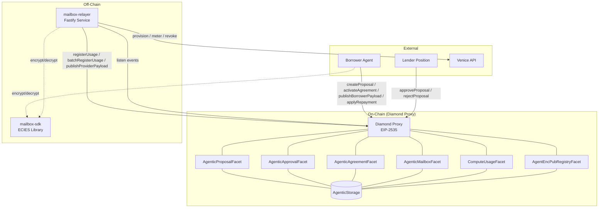
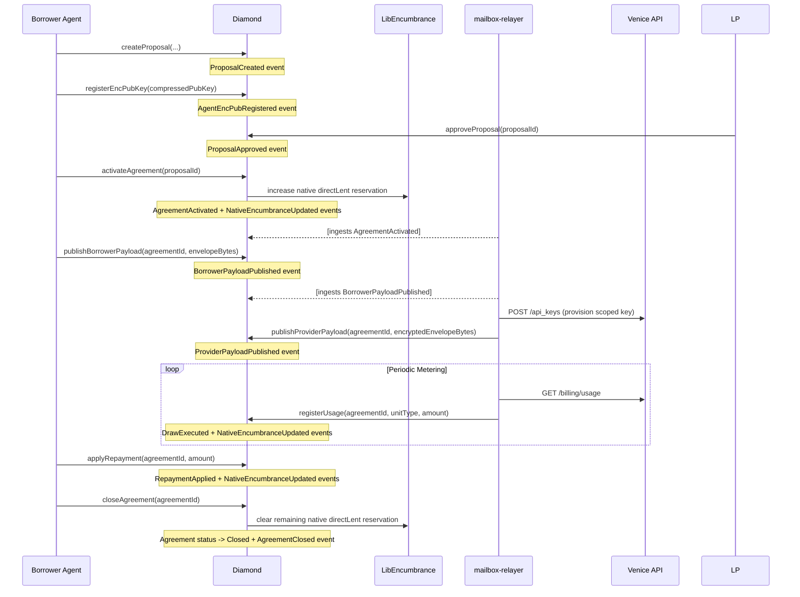
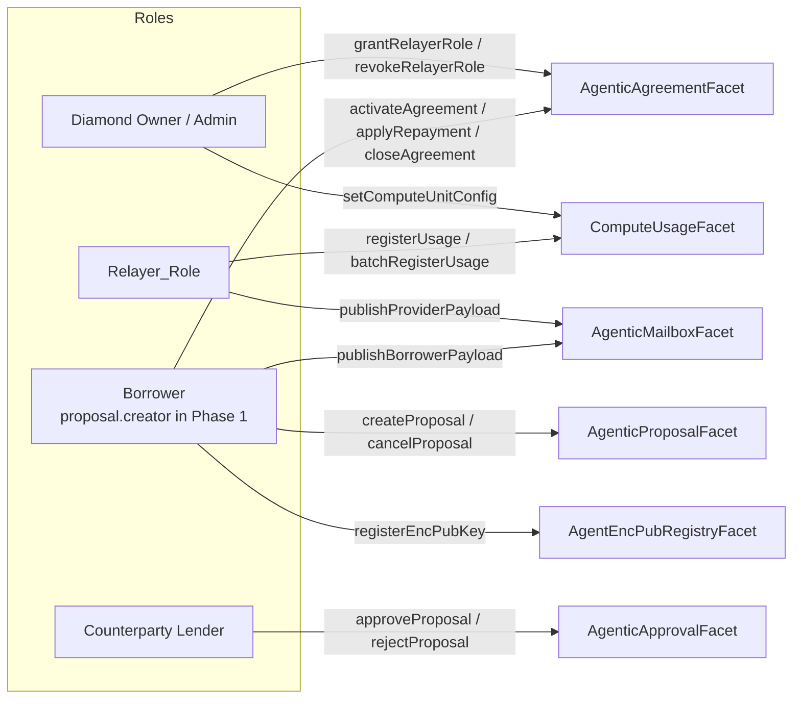
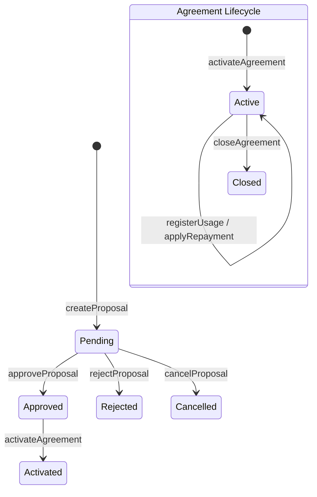

# Design Document — Synthesis Phase 1

## Overview

Phase 1 delivers the minimum viable on-chain smart contract layer for the Equalis Agentic Financing protocol. The scope is a single end-to-end Solo Compute financing flow: proposal creation, lender approval, agreement activation with native encumbrance, encrypted credential handoff via on-chain mailbox, off-chain usage metering, repayment with waterfall and fee-index distribution (70/30 on repayment revenue), and agreement closure.

All contracts are implemented as facets within an EIP-2535 Diamond proxy. The on-chain layer integrates with two existing off-chain components:
- **mailbox-relayer** — Fastify service handling event ingestion, Venice provisioning, metering submission, and kill-switch enforcement
- **mailbox-sdk** — TypeScript ECIES library providing `encryptPayload`/`decryptPayload` and `envelopeToBytes`/`envelopeFromBytes` helpers

### Design Decisions

1. **Diamond pattern (EIP-2535)** chosen for upgradeability and facet-based separation of concerns. Each logical domain (proposals, approvals, agreements, mailbox, compute usage) maps to a dedicated facet.
2. **Single shared storage struct** (`AgenticStorage`) at a namespaced position avoids storage collisions across facets while enabling cross-facet reads.
3. **MVP scope is SoloCompute only** — no pooled financing, collateral, covenants, trust modes, or ACP lifecycle. This keeps the contract surface small and auditable for hackathon demo.
4. **Phase 1 borrower identity is explicit**: `proposal.creator` is the borrower. Full ERC-8004 borrower resolution is deferred to Phase 4.
5. **Existing libraries** (`LibEncumbrance`, `LibFeeRouter`, `LibPositionNFT`) are used as-is for encumbrance tracking, fee routing, and position validation. For Agentic financing in EqualFi, native encumbrance means mutating `LibEncumbrance.position(positionKey, poolId).directLent`; module/index wrappers are not used.
6. **Lender share distribution uses a fee index rail** for pro-rata lender allocation by deposit size (instead of direct single-recipient transfer).
7. **Event schemas are locked** to match the relayer's ingestion engine exactly — no schema negotiation.

### Out of Scope

- Pooled financing and governance voting
- ERC-8004 trust modes (reputation, validation gating)
- ERC-8004 borrower resolution (Phase 1 borrower = proposal creator)
- ERC-8183 ACP job lifecycle
- Collateral management
- Net draw coverage covenants
- Delinquency, default, and write-off state transitions
- Multiple on-chain provider adapters
- Module encumbrance mirroring

---

## Architecture

### System Context Diagram



### Diamond Facet Decomposition

| Facet | Responsibility | Key Functions |
|---|---|---|
| `AgenticProposalFacet` | Proposal CRUD and queries | `createProposal`, `cancelProposal`, `getProposal`, `getProposalsByAgent`, `getProposalsByLender` |
| `AgenticApprovalFacet` | Lender approval/rejection | `approveProposal`, `rejectProposal` |
| `AgenticAgreementFacet` | Agreement lifecycle, repayment, closure, relayer role mgmt | `activateAgreement`, `applyRepayment`, `closeAgreement`, `grantRelayerRole`, `revokeRelayerRole`, `getAgreement`, `getAgreementsByAgent`, `getEncumbrance` |
| `AgenticMailboxFacet` | Encrypted credential handoff | `publishBorrowerPayload`, `publishProviderPayload`, `getBorrowerPayload`, `getProviderPayload` |
| `ComputeUsageFacet` | Usage metering and unit pricing | `setComputeUnitConfig`, `registerUsage`, `batchRegisterUsage`, `getComputeUnitConfig`, `getUnitUsage` |
| `AgentEncPubRegistryFacet` | Encryption public key registry | `registerEncPubKey`, `getEncPubKey` |

### Integration Flow (End-to-End)



---

## Components and Interfaces

### LibAgenticStorage

Internal library providing the storage pointer accessor.

```solidity
library LibAgenticStorage {
    bytes32 constant STORAGE_POSITION = keccak256("equalis.agentic.financing.storage.v1");

    function store() internal pure returns (AgenticStorage storage s) {
        bytes32 position = STORAGE_POSITION;
        assembly {
            s.slot := position
        }
    }
}
```

### AgenticProposalFacet

```solidity
interface IAgenticProposalFacet {
    /// @notice Create a SoloCompute financing proposal
    /// @param agentRegistry ERC-8004 coordinate string
    /// @param agentId ERC-8004 token ID
    /// @param lenderPositionId Position NFT ID of the target lender
    /// @param settlementAsset ERC-20 token address for accounting
    /// @param requestedAmount Credit limit in settlement asset terms
    /// @param requestedUnits Compute unit cap
    /// @param expiresAt Proposal expiry timestamp
    /// @param counterparty Lender address for solo proposals
    /// @param termsHash Hash-commit to canonical terms payload
    /// @return proposalId The assigned sequential proposal ID
    function createProposal(
        string calldata agentRegistry,
        uint256 agentId,
        uint256 lenderPositionId,
        address settlementAsset,
        uint256 requestedAmount,
        uint256 requestedUnits,
        uint40 expiresAt,
        address counterparty,
        bytes32 termsHash
    ) external returns (uint256 proposalId);

    /// @notice Cancel a pending proposal (borrower only)
    function cancelProposal(uint256 proposalId) external;

    /// @notice Read a proposal by ID
    function getProposal(uint256 proposalId) external view returns (FinancingProposal memory);

    /// @notice Get all proposal IDs for an agent
    function getProposalsByAgent(uint256 agentId) external view returns (uint256[] memory);

    /// @notice Get all proposal IDs for a lender address
    function getProposalsByLender(address lender) external view returns (uint256[] memory);
}
```

### AgenticApprovalFacet

```solidity
interface IAgenticApprovalFacet {
    /// @notice Approve a pending proposal (counterparty lender only)
    function approveProposal(uint256 proposalId) external;

    /// @notice Reject a pending proposal (counterparty lender only)
    function rejectProposal(uint256 proposalId) external;
}
```

### AgenticAgreementFacet

```solidity
interface IAgenticAgreementFacet {
    /// @notice Activate an approved proposal into a live agreement
    /// @param proposalId The approved proposal to activate
    /// @return agreementId The assigned sequential agreement ID
    function activateAgreement(uint256 proposalId) external returns (uint256 agreementId);

    /// @notice Apply repayment in settlement asset with waterfall allocation
    /// @param agreementId The active agreement
    /// @param amount Settlement asset amount to repay
    function applyRepayment(uint256 agreementId, uint256 amount) external;

    /// @notice Close a fully repaid agreement
    function closeAgreement(uint256 agreementId) external;

    /// @notice Grant Relayer_Role to an address (admin only)
    function grantRelayerRole(address account) external;

    /// @notice Revoke Relayer_Role from an address (admin only)
    function revokeRelayerRole(address account) external;

    /// @notice Read full agreement struct
    function getAgreement(uint256 agreementId) external view returns (FinancingAgreement memory);

    /// @notice Get all agreement IDs for an agent
    function getAgreementsByAgent(uint256 agentId) external view returns (uint256[] memory);

    /// @notice Get encumbered principal and units for an agreement
    function getEncumbrance(uint256 agreementId) external view returns (uint256 principalEncumbered, uint256 unitsEncumbered);
}
```

### AgenticMailboxFacet

```solidity
interface IAgenticMailboxFacet {
    /// @notice Publish encrypted borrower payload for an active agreement
    /// @param agreementId The active agreement
    /// @param envelope UTF-8 encoded ECIES envelope as bytes
    function publishBorrowerPayload(uint256 agreementId, bytes calldata envelope) external;

    /// @notice Publish encrypted provider payload (Relayer_Role only)
    /// @param agreementId The active agreement
    /// @param envelope UTF-8 encoded ECIES envelope as bytes
    function publishProviderPayload(uint256 agreementId, bytes calldata envelope) external;

    /// @notice Read borrower payload bytes for an agreement
    function getBorrowerPayload(uint256 agreementId) external view returns (bytes memory);

    /// @notice Read provider payload bytes for an agreement
    function getProviderPayload(uint256 agreementId) external view returns (bytes memory);
}
```

### ComputeUsageFacet

```solidity
interface IComputeUsageFacet {
    /// @notice Configure a compute unit type pricing (admin only)
    /// @param settlementAsset Settlement asset address for this pricing context
    /// @param unitType Canonical unit type identifier (e.g. keccak256("VENICE_TEXT_TOKEN_IN"))
    /// @param unitPrice Price per unit in settlement asset (scaled by UNIT_SCALE)
    /// @param active Whether this unit type accepts new usage registrations
    function setComputeUnitConfig(address settlementAsset, bytes32 unitType, uint256 unitPrice, bool active) external;

    /// @notice Register metered usage for an active agreement (Relayer_Role only)
    /// @param agreementId The active agreement
    /// @param unitType The compute unit type
    /// @param amount Scaled unit quantity consumed
    function registerUsage(uint256 agreementId, bytes32 unitType, uint256 amount) external;

    /// @notice Batch register usage entries (Relayer_Role only)
    /// @param entries Array of (agreementId, unitType, amount) tuples
    function batchRegisterUsage(UsageEntry[] calldata entries) external;

    /// @notice Read compute unit config
    function getComputeUnitConfig(address settlementAsset, bytes32 unitType) external view returns (ComputeUnitConfig memory);

    /// @notice Read usage for a specific unit type on an agreement
    function getUnitUsage(uint256 agreementId, bytes32 unitType) external view returns (uint256);
}

struct UsageEntry {
    uint256 agreementId;
    bytes32 unitType;
    uint256 amount;
}
```

### AgentEncPubRegistryFacet

```solidity
interface IAgentEncPubRegistryFacet {
    /// @notice Register a compressed secp256k1 public key (33 bytes, 0x02/0x03 prefix)
    /// @param pubkey The compressed public key bytes
    function registerEncPubKey(bytes calldata pubkey) external;

    /// @notice Read the registered encryption public key for an address
    function getEncPubKey(address account) external view returns (bytes memory);
}
```

### Access Control Model



Relayer role is stored as a mapping in `AgenticStorage`:

```solidity
mapping(address => bool) relayerRole;
```

Multiple addresses can hold the role simultaneously. Only the Diamond owner/admin can grant or revoke.

---

## Data Models

### AgenticStorage (Canonical Diamond Storage)

```solidity
bytes32 constant AGENTIC_STORAGE_POSITION = keccak256("equalis.agentic.financing.storage.v1");
bytes32 constant AGENTIC_ENCUMBRANCE_NAMESPACE = keccak256("equalis.agentic.encumbrance.v1"); // logical Agentic identifier for events/reasons
uint256 constant UNIT_SCALE = 1e18;
uint256 constant FEE_BPS_LENDER = 7000;
uint256 constant FEE_BPS_TOTAL = 10000;

struct AgenticStorage {
    // Sequential ID counters (initialized to 1)
    uint256 nextProposalId;
    uint256 nextAgreementId;

    // Core entity storage
    mapping(uint256 => FinancingProposal) proposals;
    mapping(uint256 => FinancingAgreement) agreements;

    // Index mappings
    mapping(uint256 => uint256[]) agentToProposals;      // agentId => proposalIds
    mapping(uint256 => uint256[]) agentToAgreements;     // agentId => agreementIds
    mapping(address => uint256[]) lenderToProposals;     // lender address => proposalIds
    mapping(address => uint256[]) lenderToAgreements;    // lender address => agreementIds

    // Compute metering
    mapping(address => mapping(bytes32 => ComputeUnitConfig)) computeUnits; // settlementAsset => unitType => config
    mapping(uint256 => mapping(bytes32 => uint256)) agreementUnitUsage; // agreementId => unitType => totalUnits
    mapping(uint256 => uint256) agreementTotalUnitsUsed; // agreementId => total units across all unit types

    // Mailbox payloads
    mapping(uint256 => bytes) borrowerPayloads;          // agreementId => envelope bytes
    mapping(uint256 => bytes) providerPayloads;          // agreementId => envelope bytes

    // Encryption public key registry
    mapping(address => bytes) encPubKeys;                // wallet => compressed secp256k1 pubkey

    // Relayer role access control
    mapping(address => bool) relayerRole;

    // Native encumbrance tracking (per agreement)
    mapping(uint256 => uint256) agreementPrincipalEncumbered;
    mapping(uint256 => uint256) agreementUnitsEncumbered;
    mapping(uint256 => bytes32) agreementLenderPositionKey;
}
```

### FinancingProposal (MVP Subset)

```solidity
struct FinancingProposal {
    uint256 id;
    ProposalType proposalType;        // SoloCompute for Phase 1
    string agentRegistry;
    uint256 agentId;
    uint256 lenderPositionId;
    address settlementAsset;
    uint256 requestedAmount;
    uint256 requestedUnits;
    uint40 createdAt;
    uint40 expiresAt;
    bytes32 termsHash;
    address counterparty;             // lender address
    address creator;                  // msg.sender at creation time
    ProposalStatus status;
}

enum ProposalType { SoloCompute }
enum ProposalStatus { Pending, Approved, Rejected, Cancelled, Activated }
```

### FinancingAgreement (MVP Subset)

```solidity
struct FinancingAgreement {
    uint256 id;
    uint256 proposalId;
    string agentRegistry;
    uint256 agentId;
    uint256 lenderPositionId;
    bytes32 lenderPositionKey;
    address settlementAsset;
    AgreementMode mode;               // MeteredUsage for Phase 1
    AgreementStatus status;

    // Funding limits
    uint256 creditLimit;
    uint256 unitLimit;

    // Current balances
    uint256 principalDrawn;
    uint256 principalRepaid;
    uint256 interestAccrued;
    uint256 feesAccrued;

    // Encumbrance tracking
    uint256 principalEncumbered;
    uint256 unitsEncumbered;

    // Participants
    address borrower;                 // proposal.creator in Phase 1
    address lender;                   // counterparty from proposal
}

enum AgreementMode { MeteredUsage }
enum AgreementStatus { Active, Closed }
```

### ComputeUnitConfig

```solidity
struct ComputeUnitConfig {
    bytes32 unitType;
    uint256 unitPrice;                // settlement asset per unit (scaled by UNIT_SCALE)
    bool active;
    address settlementAsset;
}
```

### State Transitions



### Repayment Waterfall Algorithm

```
function applyRepayment(agreementId, amount):
    agreement = agreements[agreementId]
    remaining = amount

    // Step 1: Fees first
    toFees = min(remaining, agreement.feesAccrued)
    agreement.feesAccrued -= toFees
    remaining -= toFees

    // Step 2: Interest second
    toInterest = min(remaining, agreement.interestAccrued)
    agreement.interestAccrued -= toInterest
    remaining -= toInterest

    // Step 3: Principal last
    toPrincipal = min(remaining, agreement.principalDrawn - agreement.principalRepaid)
    agreement.principalRepaid += toPrincipal
    remaining -= toPrincipal

    // Invariant: toFees + toInterest + toPrincipal == amount
    // amount must not exceed total outstanding debt

    // Revenue split (principal excluded)
    revenueBase = toFees + toInterest
    lenderShare = revenueBase * 7000 / 10000
    protocolShare = revenueBase - lenderShare

    // Native encumbrance release (proportional to principal repaid)
    if toPrincipal > 0:
        agreement.principalEncumbered -= toPrincipal
        LibEncumbrance.position(positionKey, poolId).directLent -= toPrincipal
        LibActiveCreditIndex.applyEncumbranceDecrease(pool, poolId, positionKey, toPrincipal)

    // Transfer settlement asset from borrower
    IERC20(settlementAsset).transferFrom(borrower, address(this), amount)
    LibFeeRouter.route(protocolShare)
    LibFeeIndex.distributeToLenders(lenderShare)
```

### Encumbrance Management

Encumbrance tracks how much of a lender's position capital is reserved for active agreements.

| Event | Encumbrance Action |
|---|---|
| `activateAgreement` | Increase `LibEncumbrance.position(positionKey, poolId).directLent` by `creditLimit` — full credit limit reserved |
| `registerUsage` | No change to encumbered amount (debt accrues within existing encumbrance) |
| `applyRepayment` (principal portion) | Decrease `directLent` by `toPrincipal` — proportional release |
| `closeAgreement` | Decrease `directLent` by remaining reserved amount — full release |

`AGENTIC_ENCUMBRANCE_NAMESPACE` remains a logical Agentic identifier for event/reason tagging and bookkeeping; it is not a direct argument to current `LibEncumbrance` mutation functions.

Position key is derived from the lender's position NFT ID via `LibPositionNFT.getPositionKey(positionNFTContract, lenderPositionId)`.

### Event Specifications

All events match the canonical spec (Section 11) and the relayer's expected schema:

```solidity
// Proposal lifecycle
event ProposalCreated(uint256 indexed proposalId, ProposalType proposalType, uint256 indexed agentId);
event ProposalApproved(uint256 indexed proposalId, address indexed approver);
event ProposalRejected(uint256 indexed proposalId, address indexed rejector);

// Agreement lifecycle
event AgreementActivated(uint256 indexed agreementId, uint256 indexed proposalId, AgreementMode mode);
event AgreementClosed(uint256 indexed agreementId);

// Credential handoff
event AgentEncPubRegistered(address indexed agentWallet, bytes pubkey);
event BorrowerPayloadPublished(uint256 indexed agreementId, address indexed borrower, bytes envelope);
event ProviderPayloadPublished(uint256 indexed agreementId, address indexed provider, bytes envelope);

// Usage and accounting
event DrawExecuted(uint256 indexed agreementId, uint256 amount, uint256 units, address recipient);
event RepaymentApplied(uint256 indexed agreementId, uint256 amount, uint256 toFees, uint256 toInterest, uint256 toPrincipal);

// Encumbrance
event NativeEncumbranceUpdated(
    uint256 indexed agreementId,
    bytes32 indexed positionKey,
    uint256 principalEncumbered,
    uint256 unitsEncumbered,
    bytes32 reason
);
```

Envelope bytes in `BorrowerPayloadPublished` and `ProviderPayloadPublished` are UTF-8 encoded stringified JSON matching the `@equalfi/mailbox-sdk` format: `{iv, ephemPublicKey, ciphertext, mac}`. The relayer decodes bytes to string and calls `decryptPayload(privateKey, envelopeString)`. Re-publishing for the same `agreementId` overwrites prior payload, and the latest payload is authoritative.

### Encumbrance Reason Constants

```solidity
bytes32 constant REASON_ACTIVATION = keccak256("ACTIVATION");
bytes32 constant REASON_USAGE      = keccak256("USAGE");
bytes32 constant REASON_REPAYMENT  = keccak256("REPAYMENT");
bytes32 constant REASON_CLOSURE    = keccak256("CLOSURE");
```


---

## Correctness Properties

*A property is a characteristic or behavior that should hold true across all valid executions of a system — essentially, a formal statement about what the system should do. Properties serve as the bridge between human-readable specifications and machine-verifiable correctness guarantees.*

### Property 1: Proposal creation produces valid pending proposal with sequential ID

*For any* valid set of proposal parameters (non-zero `requestedAmount`, non-zero `requestedUnits`, non-zero `settlementAsset`, non-zero `counterparty`, future `expiresAt`), calling `createProposal` should produce a proposal with status `Pending`, a sequential `proposalId` equal to the previous `nextProposalId`, the proposal should be retrievable via `getProposal`, and the `proposalId` should appear in both `agentToProposals[agentId]` and `lenderToProposals[counterparty]`.

**Validates: Requirements 2.1, 2.7, 2.8**

### Property 2: Proposal approval transitions status and emits event

*For any* pending proposal where the caller is the designated counterparty and `block.timestamp < expiresAt`, calling `approveProposal` should transition the proposal status to `Approved` and emit `ProposalApproved(proposalId, approver)`.

**Validates: Requirements 4.1, 4.2**

### Property 3: Proposal rejection transitions status and emits event

*For any* pending proposal where the caller is the designated counterparty, calling `rejectProposal` should transition the proposal status to `Rejected` and emit `ProposalRejected(proposalId, rejector)`.

**Validates: Requirements 5.1, 5.2**

### Property 4: Proposal cancellation by creator transitions status

*For any* pending proposal where the caller is the original creator, calling `cancelProposal` should transition the proposal status to `Cancelled`. For any non-creator caller, the call should revert. For any non-Pending proposal, the call should revert.

**Validates: Requirements 3.1, 3.2, 3.3**

### Property 5: Agreement activation creates correct agreement and encumbers full credit limit

*For any* approved proposal, calling `activateAgreement` should: create a `FinancingAgreement` with status `Active`, mode `MeteredUsage`, `borrower = proposal.creator`, `creditLimit` equal to `proposal.requestedAmount`, `unitLimit` equal to `proposal.requestedUnits`, `principalEncumbered` equal to `creditLimit`; transition the proposal status to `Activated`; append the `agreementId` to both `agentToAgreements` and `lenderToAgreements`; and emit `AgreementActivated` and `NativeEncumbranceUpdated` with reason `ACTIVATION`.

**Validates: Requirements 6.1, 6.2, 6.3, 6.4, 6.5, 6.6, 6.7, 23.1**

### Property 6: Encryption public key round-trip

*For any* valid compressed secp256k1 public key (33 bytes, prefix `0x02` or `0x03`), registering it via `registerEncPubKey` and then reading via `getEncPubKey(msg.sender)` should return the identical bytes. Registering a second key for the same address should overwrite the first.

**Validates: Requirements 7.1, 7.2, 7.3**

### Property 7: Mailbox envelope round-trip (borrower and provider)

*For any* non-empty envelope bytes and any active agreement, publishing via `publishBorrowerPayload` then reading via `getBorrowerPayload` should return byte-identical data. The same holds for `publishProviderPayload` / `getProviderPayload`. The contract must not modify, truncate, or pad the stored bytes. Re-publish behavior is overwrite-only; latest payload is authoritative.

**Validates: Requirements 24.1, 24.2, 24.3, 8.1, 9.1**

### Property 8: Usage registration computes correct debt delta and accumulates units

*For any* active agreement, active `unitType` with `unitPrice > 0`, and non-zero `amount` where the resulting debt and units stay within limits, calling `registerUsage` should: increase `principalDrawn` by exactly `amount * unitPrice / UNIT_SCALE`, increase `agreementUnitUsage[agreementId][unitType]` by `amount`, and emit `DrawExecuted(agreementId, debtDelta, amount, address(0))`.

**Validates: Requirements 12.1, 12.2, 12.5, 12.6**

### Property 9: Batch usage equivalence (metamorphic)

*For any* sequence of valid usage entries, processing them via `batchRegisterUsage` should produce the same final agreement state (principalDrawn, unit usage per type) as processing each entry individually via `registerUsage` in the same order.

**Validates: Requirements 13.1**

### Property 10: Repayment waterfall allocation sums to applied amount

*For any* active agreement with arbitrary `feesAccrued`, `interestAccrued`, and outstanding principal, and any non-zero repayment `amount` not exceeding total debt, the waterfall allocation must satisfy: `toFees + toInterest + toPrincipal == amount`, fees are allocated first (up to `feesAccrued`), then interest (up to `interestAccrued`), then principal (up to outstanding principal).

**Validates: Requirements 14.1, 14.6, 22.1**

### Property 11: Fee split conservation

*For any* repayment amount, `lenderShare + protocolShare` must equal `revenueBase = toFees + toInterest` with at most 1 wei rounding difference, where `lenderShare = revenueBase * 7000 / 10000` and `protocolShare = revenueBase - lenderShare`.

**Validates: Requirements 14.2, 22.3**

### Property 12: Encumbrance conservation invariant

*For any* active agreement, at every point in the lifecycle, `principalEncumbered` must equal `creditLimit - principalRepaid`. Specifically: after activation `principalEncumbered == creditLimit`, after each repayment with principal portion `p` the encumbrance decreases by `p`, and after closure `principalEncumbered == 0`.

**Validates: Requirements 23.1, 23.2, 23.3, 23.4, 14.5, 14.7**

### Property 13: Principal repaid never exceeds principal drawn

*For any* sequence of usage registrations and repayments on an agreement, `principalRepaid` must never exceed `principalDrawn` at any point.

**Validates: Requirements 22.2**

### Property 14: Principal drawn never exceeds credit limit

*For any* sequence of usage registrations on an agreement, `principalDrawn` must never exceed `creditLimit`.

**Validates: Requirements 22.4, 12.3**

### Property 15: Unit usage never exceeds unit limit

*For any* sequence of usage registrations on an agreement, the total units consumed across all unit types must never exceed `unitLimit`.

**Validates: Requirements 12.4**

### Property 16: Relayer role grant/revoke round-trip

*For any* address, granting `Relayer_Role` should allow that address to call relayer-restricted functions (`registerUsage`, `batchRegisterUsage`, `publishProviderPayload`). Revoking the role should prevent access. Multiple addresses can hold the role simultaneously.

**Validates: Requirements 16.2, 16.3, 16.4**

### Property 17: Non-existent ID lookups revert

*For any* `proposalId` or `agreementId` that has not been created, calling any function that references that ID should revert.

**Validates: Requirements 21.3**

### Property 18: Closure requires zero outstanding debt

*For any* active agreement where `principalDrawn == principalRepaid` and `feesAccrued == 0` and `interestAccrued == 0`, calling `closeAgreement` should transition status to `Closed` and release all remaining encumbrance. For any agreement with outstanding debt, the call should revert.

**Validates: Requirements 15.1, 15.2, 15.3**

### Property 19: Deactivated unit types reject usage registration

*For any* unit type where `active == false`, calling `registerUsage` with that unit type should revert, regardless of other parameters being valid.

**Validates: Requirements 11.4, 12.9**

---

## Error Handling

### Revert Strategy

All validation failures revert with custom errors for gas efficiency and debuggability:

```solidity
// Proposal errors
error ProposalNotFound(uint256 proposalId);
error ProposalNotPending(uint256 proposalId, ProposalStatus current);
error ProposalExpired(uint256 proposalId, uint40 expiresAt);
error NotProposalCreator(uint256 proposalId, address caller);
error NotCounterparty(uint256 proposalId, address caller);
error InvalidExpiresAt(uint40 expiresAt);
error InvalidAmount(uint256 amount);
error InvalidUnits(uint256 units);
error InvalidAddress(address addr);

// Agreement errors
error AgreementNotFound(uint256 agreementId);
error AgreementNotActive(uint256 agreementId, AgreementStatus current);
error ProposalNotApproved(uint256 proposalId, ProposalStatus current);
error OutstandingDebtRemains(uint256 agreementId, uint256 principalOutstanding, uint256 feesOutstanding, uint256 interestOutstanding);
error CreditLimitExceeded(uint256 agreementId, uint256 newDrawn, uint256 creditLimit);
error UnitLimitExceeded(uint256 agreementId, uint256 newUsed, uint256 unitLimit);

// Mailbox errors
error EmptyEnvelope();
error NotBorrower(uint256 agreementId, address caller);

// Encryption key errors
error InvalidKeyLength(uint256 length);
error InvalidKeyPrefix(bytes1 prefix);

// Compute errors
error UnitTypeNotActive(bytes32 unitType);
error InvalidUnitPrice(uint256 unitPrice);
error ZeroUsageAmount();

// Access control errors
error NotRelayer(address caller);
error NotAdmin(address caller);
```

### CEI Pattern Enforcement

All state-changing functions that interact with external contracts (ERC-20 transfers, LibEncumbrance, LibFeeRouter) follow checks-effects-interactions:

1. **Checks**: Validate all inputs, access control, and state preconditions
2. **Effects**: Update all storage state (balances, statuses, encumbrance tracking)
3. **Interactions**: External calls (ERC-20 `transferFrom`, library calls)

### Reentrancy Guard

`applyRepayment` and `activateAgreement` use OpenZeppelin's `ReentrancyGuard` (or Diamond-compatible equivalent using a storage-based lock flag in `AgenticStorage`):

```solidity
// In AgenticStorage
bool reentrancyLock;

modifier nonReentrant() {
    AgenticStorage storage s = LibAgenticStorage.store();
    require(!s.reentrancyLock, "ReentrancyGuard: reentrant call");
    s.reentrancyLock = true;
    _;
    s.reentrancyLock = false;
}
```

---

## Testing Strategy

### Dual Testing Approach

Testing uses both unit tests and property-based tests. For hackathon fast-track execution, unit tests and the MVP lifecycle property path are required in Phase 1; the full 19-property matrix is deferred to Phase 5.

**Unit Tests** focus on:
- Specific examples demonstrating correct behavior (e.g., creating a proposal with known parameters and verifying exact field values)
- Edge cases: zero-amount rejection, expired proposal rejection, wrong-caller reverts, empty envelope rejection, invalid key prefix/length
- Integration points: LibEncumbrance calls, LibFeeRouter routing, ERC-20 transferFrom
- Event emission verification with exact parameter matching

**Property-Based Tests** focus on:
- Universal properties that hold for all valid inputs (Properties 1–19 above)
- Comprehensive input coverage through randomized generation
- Accounting invariants under arbitrary operation sequences
- In fast-track mode, only MVP-critical properties are required in Phase 1; full property matrix is completed in Phase 5

### Property-Based Testing Configuration

- **Library**: Foundry's `forge-std` with built-in fuzzing (`vm.assume` for input constraints)
- **Minimum iterations**: 256 runs per property test (Foundry default, configurable via `foundry.toml`)
- **Each property test** references its design document property via comment tag
- **Tag format**: `// Feature: synthesis-phase1, Property {N}: {title}`
- **Each correctness property** is implemented by a single fuzz test function

### Test Organization

```
test/
├── unit/
│   ├── AgenticProposalFacet.t.sol      — proposal CRUD unit tests
│   ├── AgenticApprovalFacet.t.sol      — approval/rejection unit tests
│   ├── AgenticAgreementFacet.t.sol     — activation, repayment, closure unit tests
│   ├── AgenticMailboxFacet.t.sol       — mailbox publish/read unit tests
│   ├── ComputeUsageFacet.t.sol         — usage registration unit tests
│   └── AgentEncPubRegistryFacet.t.sol  — key registry unit tests
├── property/
│   ├── ProposalProperties.t.sol        — Properties 1, 4, 17
│   ├── ApprovalProperties.t.sol        — Properties 2, 3
│   ├── AgreementProperties.t.sol       — Properties 5, 18
│   ├── MailboxProperties.t.sol         — Properties 6, 7
│   ├── UsageProperties.t.sol           — Properties 8, 9, 15, 19
│   ├── RepaymentProperties.t.sol       — Properties 10, 11
│   ├── InvariantProperties.t.sol       — Properties 12, 13, 14
│   └── AccessControlProperties.t.sol   — Property 16
```

### Key Test Scenarios

1. **Full lifecycle**: create → approve → activate → register usage → repay → close
2. **Waterfall ordering**: agreement with fees + interest + principal, verify allocation order
3. **Encumbrance conservation**: verify `principalEncumbered == creditLimit - principalRepaid` after every state transition
4. **Batch vs single equivalence**: same usage entries processed both ways, compare final state
5. **Mailbox round-trip**: publish arbitrary bytes, read back, compare byte-for-byte
6. **Access control matrix**: verify every function rejects unauthorized callers
