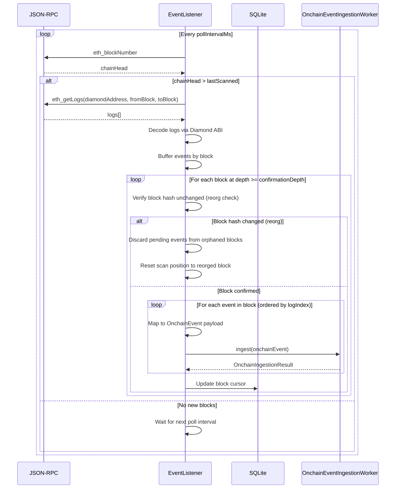
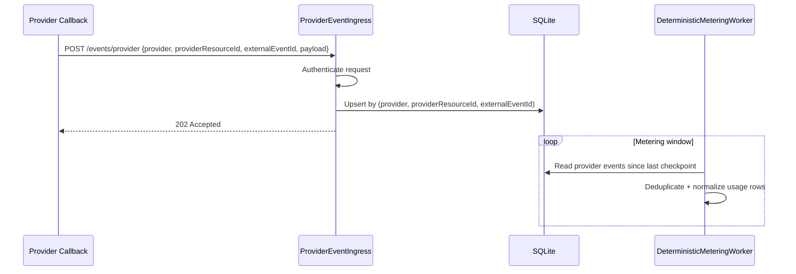
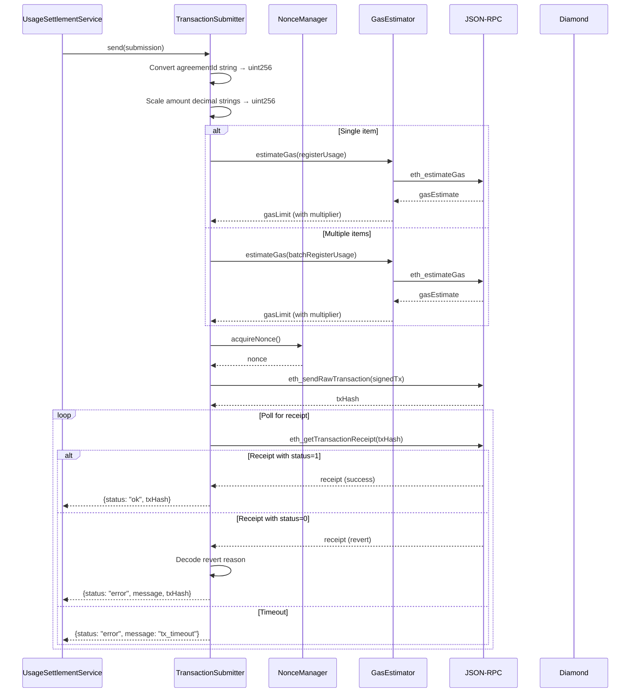

# Design Document — Synthesis Phase 2: Relayer Integration

## Overview

Phase 2 delivers the integration layer that connects the existing mailbox-relayer Fastify service to the Phase 1 Diamond proxy smart contracts. Three new TypeScript modules are added to the relayer codebase:

1. **EventListener** — Subscribes to Diamond proxy events via JSON-RPC polling, handles reorg safety via confirmation depth, persists a block cursor to SQLite, and delivers decoded events to the existing `OnchainEventIngestionWorker.ingest()` method in-process.
2. **TransactionSubmitter** — Implements the existing `UsageSettlementSender` interface for on-chain usage settlement via `registerUsage`/`batchRegisterUsage`, and handles `publishProviderPayload` calls after successful provider provisioning (Venice/Bankr/Lambda/RunPod). Includes a `NonceManager` and gas estimation sub-components.
3. **ProviderEventIngress** — Authenticated webhook/event ingestion for provider callbacks (for example RunPod async job completion), with durable deduped persistence for metering consumption.

All three modules integrate into the existing relayer process — no new services, no additional deployable binaries.

### Hackathon Note: Cross-Chain ERC-8004 Identity

If the Diamond is deployed on a Target_Chain (e.g. Arbitrum) while the ERC-8004 registry of record lives on a different chain (e.g. Base), Phase 2 can support a **temporary offchain resolver** mode for the hackathon:

- ERC-8004 identity is treated as an offchain-resolved identifier (`agentRegistry`, `agentId`), not an onchain-gated requirement.
- If `IDENTITY_MODE=erc8004_offchain`, the relayer SHALL verify an identity proof embedded in the encrypted borrower payload before provisioning/publishing provider credentials.
- If `IDENTITY_MODE=none`, the relayer SHALL skip identity proof verification and log that enforcement is disabled.
- This avoids adding an onchain oracle/bridge as hackathon scope, while keeping the architecture compatible with a later onchain resolver/oracle in Phase 4.

### Design Decisions

1. **In-process event delivery** rather than HTTP `POST /events/onchain`. The `EventListener` calls `OnchainEventIngestionWorker.ingest()` directly, avoiding network overhead and auth token management for self-delivery. The HTTP endpoint remains available for external/manual event injection.
2. **ethers.js v6** for JSON-RPC interaction. The relayer already uses Node.js; ethers provides typed ABI encoding/decoding, EIP-1559 gas estimation, and wallet signing out of the box.
3. **Confirmation depth model** for reorg safety. Events are buffered until their block reaches `confirmationDepth` blocks behind chain head. This is simpler than finality-tracking and sufficient for L2 deployments; choose `confirmationDepth` per target chain (e.g. Arbitrum vs Base).
4. **Sequential nonce manager with mutex**. A single async mutex serializes transaction submissions, preventing nonce races. On nonce errors, the manager re-syncs from chain and retries once.
5. **Existing SQLite store extended** with `block_cursors` (event scan cursor) and `provider_events` (deduped provider callbacks) tables. No schema changes to existing tables.
6. **Key separation enforced at startup**. The signing key (`RELAYER_PRIVATE_KEY`) and encryption key (`RELAYER_ENCRYPTION_PRIVATE_KEY`) are validated to be different. This prevents a single key compromise from affecting both transaction signing and mailbox encryption.
7. **Decimal-to-uint256 scaling uses BigInt arithmetic** with `UNIT_SCALE = 10^18`. The relayer's decimal string amounts (e.g., `"1.5"`) are converted to scaled BigInt values for contract calls, and on-chain uint256 values are converted back to decimal strings for event delivery.
8. **Webhook-first provider completion ingestion**. Provider callback events are persisted with dedup keys and consumed by metering before fallback polling paths, preventing missed usage due to short provider result retention windows.
9. **Activation context is auto-resolved in Phase 2**. `AgreementActivated` does not include provider in Phase 1 event logs, so activation processing resolves provider and borrower address from on-chain agreement state (`getAgreement`) before provisioning and provider payload publication.

### Out of Scope

- Modifications to Phase 1 Diamond facets or storage layout
- Large redesign of the relayer's core ingestion, metering, or kill-switch logic (minimal provider-event ingestion hooks are in scope)
- WebSocket subscriptions (polling only for Phase 2)
- Lambda and RunPod adapter implementations (Phase 3)
- Production mainnet deployment or HSM/KMS key management
- Frontend or UI components

---

## Architecture

### System Context Diagram

```mermaid
graph TB
    subgraph Diamond ["On-Chain (Diamond Proxy)"]
        DP[Diamond Proxy<br/>EIP-2535]
        CUF[ComputeUsageFacet]
        AMF[AgenticMailboxFacet]
        EPR[AgentEncPubRegistryFacet]
    end

    subgraph Relayer ["mailbox-relayer (Fastify)"]
        EL[EventListener]
        TS[TransactionSubmitter]
        PEI[ProviderEventIngress]
        NM[NonceManager]
        GE[GasEstimator]
        OW[OnchainEventIngestionWorker]
        MW[DeterministicMeteringWorker]
        USS[UsageSettlementService]
        DB[(SQLite Store)]
    end

    subgraph External
        RPC[JSON-RPC Provider<br/>Target Chain]
        PC[Provider Callbacks<br/>RunPod/Lambda/Bankr]
    end

    EL -->|eth_blockNumber / eth_getLogs| RPC
    EL -->|ingest&#40;event&#41;| OW
    EL -->|persist block cursor| DB
    PC -->|webhook events| PEI
    PEI -->|persist deduped events| DB

    USS -->|send&#40;submission&#41;| TS
    TS -->|registerUsage / batchRegisterUsage| DP
    TS -->|publishProviderPayload| DP
    TS -->|getEncPubKey| EPR
    TS -->|eth_sendRawTransaction| RPC
    TS --> NM
    TS --> GE
    NM -->|eth_getTransactionCount| RPC
    GE -->|eth_estimateGas / eth_feeHistory| RPC

    OW -->|trigger provider payload| TS
    MW -->|read provider events + prepare submissions| DB
    USS -->|read submissions| DB

    RPC -->|blocks + logs| EL
```



### Event Listener Flow



### Provider Event Ingress Flow



### Transaction Submitter Flow



---

## Components and Interfaces

### EventListener

```typescript
import { z } from 'zod';

/** Configuration for the EventListener */
export const eventListenerConfigSchema = z.object({
  rpcUrl: z.string().url(),
  diamondAddress: z.string().regex(/^0x[a-fA-F0-9]{40}$/),
  chainId: z.number().int().positive(),
  startBlock: z.number().int().nonnegative().default(0),
  confirmationDepth: z.number().int().nonnegative().default(12),
  pollIntervalMs: z.number().int().positive().default(2000),
  maxRetryIntervalMs: z.number().int().positive().default(60000),
});

export type EventListenerConfig = z.infer<typeof eventListenerConfigSchema>;

/** Diamond event types the listener subscribes to */
export const DIAMOND_EVENT_SIGNATURES = [
  'AgreementActivated(uint256,uint256,uint8)',
  'BorrowerPayloadPublished(uint256,address,bytes)',
  'ProviderPayloadPublished(uint256,address,bytes)',
  'CoverageCovenantBreached(uint256,uint256,uint256,uint256,uint256)',
  'DrawRightsTerminated(uint256,bytes32)',
  'AgreementDefaulted(uint256,uint256)',
  'AgreementClosed(uint256)',
  'DrawExecuted(uint256,uint256,uint256,address)',
  'RepaymentApplied(uint256,uint256,uint256,uint256,uint256)',
  'NativeEncumbranceUpdated(uint256,bytes32,uint256,uint256,bytes32)',
] as const;

/** Mapping from Diamond event name to relayer eventType */
export const EVENT_TYPE_MAP: Record<string, string> = {
  AgreementActivated: 'activation',
  BorrowerPayloadPublished: 'mailbox',
  // Reserved mapping for parity; ProviderPayloadPublished is observability-only in Phase 2 delivery.
  ProviderPayloadPublished: 'mailbox',
  CoverageCovenantBreached: 'risk_covenant_breached',
  DrawRightsTerminated: 'risk_draw_terminated',
  AgreementDefaulted: 'risk_defaulted',
  AgreementClosed: 'agreement_closed',
  DrawExecuted: 'draw',
  RepaymentApplied: 'repayment',
  NativeEncumbranceUpdated: 'encumbrance',
};

export interface EventListenerStatus {
  lastConfirmedBlock: number;
  chainHead: number;
  blocksBehind: number;
  isPolling: boolean;
}

export interface EventListener {
  /** Start polling for events */
  start(): Promise<void>;

  /** Graceful shutdown: finish in-flight batch, persist cursor, stop polling */
  stop(): Promise<void>;

  /** Current operational status */
  status(): EventListenerStatus;
}
```

### ProviderEventIngress

```typescript
export interface ProviderEventIngressStatus {
  enabled: boolean;
  lastAcceptedAt?: string;
}

export interface ProviderEventIngress {
  /** Register provider callback routes on the Fastify app */
  register(app: FastifyInstance): Promise<void>;

  /** Current operational status */
  status(): ProviderEventIngressStatus;
}
```

### TransactionSubmitter

```typescript
import { z } from 'zod';
import { UsageSettlementSender, UsageSettlementSenderResult } from './settlement';
import { UsageSubmissionRecord } from './store';

/** Configuration for the TransactionSubmitter */
export const txSubmitterConfigSchema = z.object({
  rpcUrl: z.string().url(),
  diamondAddress: z.string().regex(/^0x[a-fA-F0-9]{40}$/),
  chainId: z.number().int().positive(),
  relayerPrivateKey: z.string().regex(/^0x[a-fA-F0-9]{64}$/),
  encryptionPrivateKey: z.string().regex(/^0x[a-fA-F0-9]{64}$/).optional(),
  txTimeoutMs: z.number().int().positive().default(60000),
  gasLimitMultiplier: z.number().positive().default(1.2),
  maxGasPriceGwei: z.number().positive().default(100),
  lowBalanceThresholdEth: z.number().positive().default(0.01),
});

export type TxSubmitterConfig = z.infer<typeof txSubmitterConfigSchema>;

export const UNIT_SCALE = 10n ** 18n;

export interface TransactionSubmitterStatus {
  walletAddress: string;
  walletBalance: string;
  pendingNonce: number;
  isEnabled: boolean;
}

/**
 * On-chain UsageSettlementSender implementation.
 * Implements the existing UsageSettlementSender interface so
 * UsageSettlementService can delegate to it without modification.
 */
export interface TransactionSubmitter extends UsageSettlementSender {
  send(submission: UsageSubmissionRecord): Promise<UsageSettlementSenderResult>;

  /** Publish encrypted provider payload on-chain after provider provisioning */
  publishProviderPayload(
    agreementId: string,
    providerCredentials: Record<string, unknown>,
    borrowerAddress: string
  ): Promise<{ txHash?: string; error?: string }>;

  /** Current operational status */
  status(): Promise<TransactionSubmitterStatus>;
}
```

### NonceManager

```typescript
/**
 * Serializes transaction nonce assignment to prevent races.
 * Initializes from eth_getTransactionCount("pending") on startup.
 * Re-syncs from chain on nonce-related errors.
 */
export interface NonceManager {
  /** Initialize nonce from chain */
  init(): Promise<void>;

  /** Acquire the next nonce (serialized via mutex) */
  acquireNonce(): Promise<number>;

  /** Release/confirm a nonce was used (advances internal counter) */
  confirmNonce(nonce: number): void;

  /** Re-sync nonce from chain after a nonce error */
  resync(): Promise<void>;

  /** Current pending nonce value */
  currentNonce(): number;
}
```

### GasEstimator

```typescript
/**
 * Estimates gas and computes EIP-1559 fee parameters.
 */
export interface GasEstimator {
  /** Estimate gas for a transaction, applying the configured multiplier */
  estimateGas(tx: { to: string; data: string; from: string }): Promise<bigint>;

  /** Get current EIP-1559 fee parameters */
  getFeeData(): Promise<{
    maxFeePerGas: bigint;
    maxPriorityFeePerGas: bigint;
  }>;
}
```

### Agreement ID and Amount Conversion Utilities

```typescript
/**
 * Convert relayer's string agreementId to uint256 for contract calls.
 * Throws if the string is not a valid non-negative integer.
 */
export function agreementIdToUint256(id: string): bigint;

/**
 * Convert on-chain uint256 agreementId to relayer's string representation.
 */
export function uint256ToAgreementId(id: bigint): string;

/**
 * Scale a decimal string amount by UNIT_SCALE (10^18) for on-chain submission.
 * Returns the scaled BigInt value.
 * Throws on overflow, zero, or negative values.
 */
export function scaleAmountToUint256(decimalAmount: string): bigint;

/**
 * Convert a scaled uint256 amount back to a decimal string.
 * Inverse of scaleAmountToUint256.
 */
export function uint256ToDecimalAmount(scaled: bigint): string;

/**
 * Convert a unitType string (e.g., "VENICE_TEXT_TOKEN_IN") to bytes32.
 * Uses keccak256 hashing, matching the Diamond's unit type identifiers.
 */
export function unitTypeToBytes32(unitType: string): string;
```

### Integration with Existing Relayer

```typescript
// In app.ts or a new bootstrap module:

import { EventListener } from './event-listener';
import { TransactionSubmitter } from './tx-submitter';
import { ProviderEventIngress } from './provider-event-ingress';

/**
 * Extended buildApp signature — the EventListener, TransactionSubmitter,
 * and ProviderEventIngress
 * are optional parameters, preserving backward compatibility.
 */
export function buildApp(
  store: MessageStore,
  providerRegistry: ComputeAdapterRegistry,
  meteringWorker: DeterministicMeteringWorker,
  meteringScheduler?: MeteringScheduler,
  killSwitchService: KillSwitchEnforcementService,
  killSwitchRetryScheduler?: KillSwitchRetryScheduler,
  usageSettlementService: UsageSettlementService,
  usageSettlementScheduler?: UsageSettlementScheduler,
  eventListener?: EventListener,
  txSubmitter?: TransactionSubmitter,
  providerEventIngress?: ProviderEventIngress,
  options?: BuildAppOptions
): FastifyInstance;
```

The `EventListener` is started after the Fastify server is listening. The `TransactionSubmitter` is passed as the `UsageSettlementSender` to `UsageSettlementService` at construction time, replacing the `DisabledUsageSettlementSender`. `ProviderEventIngress` registers authenticated provider callback routes in the same Fastify process.


### Health Endpoint Extension

The existing `/health/ready` endpoint is extended to include EventListener, TransactionSubmitter, and ProviderEventIngress status:

```typescript
app.get('/health/ready', async () => {
  const metering = meteringScheduler?.status();
  const killSwitchRetry = killSwitchRetryScheduler?.status();
  const usageSettlement = usageSettlementScheduler?.status();
  const eventListenerStatus = eventListener?.status();
  const txSubmitterStatus = txSubmitter ? await txSubmitter.status() : undefined;
  const providerIngressStatus = providerEventIngress?.status();

  return {
    ready: /* existing logic */,
    schedulers: { metering, killSwitchRetry, usageSettlement },
    eventListener: eventListenerStatus ?? null,
    txSubmitter: txSubmitterStatus ?? null,
    providerEventIngress: providerIngressStatus ?? null,
  };
});
```

---

## Data Models

### New SQLite Table: `block_cursors`

Stores the EventListener's scanning position per chain. Supports multi-chain in the future.

```sql
CREATE TABLE IF NOT EXISTS block_cursors (
  chain_id       INTEGER NOT NULL,
  last_confirmed INTEGER NOT NULL,
  block_hash     TEXT,
  updated_at     TEXT    NOT NULL,
  PRIMARY KEY (chain_id)
);
```

### New SQLite Table: `provider_events`

Stores authenticated provider callback events for webhook-first metering.

```sql
CREATE TABLE IF NOT EXISTS provider_events (
  provider             TEXT    NOT NULL,
  provider_resource_id TEXT    NOT NULL,
  external_event_id    TEXT    NOT NULL,
  payload_json         TEXT    NOT NULL,
  observed_at          TEXT    NOT NULL,
  created_at           TEXT    NOT NULL,
  PRIMARY KEY (provider, provider_resource_id, external_event_id)
);
```

### New Store Interface Methods

```typescript
// Added to MessageStore interface
export interface MessageStore {
  // ... existing methods ...

  /** Persist the last confirmed block number for a chain */
  setBlockCursor(chainId: number, lastConfirmed: number, blockHash?: string): void;

  /** Read the last confirmed block number for a chain */
  getBlockCursor(chainId: number): { lastConfirmed: number; blockHash?: string } | undefined;

  /** Persist a provider callback event (idempotent by unique key) */
  upsertProviderEvent(
    provider: string,
    providerResourceId: string,
    externalEventId: string,
    payloadJson: string,
    observedAt: string
  ): void;

  /** Read provider callback events in a metering window */
  listProviderEvents(
    provider: string,
    providerResourceId: string,
    fromIso: string,
    toIso: string
  ): Array<{ externalEventId: string; payloadJson: string; observedAt: string }>;
}
```

### Environment Configuration Schema

```typescript
export const phase2EnvSchema = z.object({
  // Shared chain config
  RPC_URL: z.string().url(),
  DIAMOND_ADDRESS: z.string().regex(/^0x[a-fA-F0-9]{40}$/),
  CHAIN_ID: z.coerce.number().int().positive(),

  // Event Listener
  EVENT_LISTENER_START_BLOCK: z.coerce.number().int().nonnegative().default(0),
  CONFIRMATION_DEPTH: z.coerce.number().int().nonnegative().default(12),
  EVENT_POLL_INTERVAL_MS: z.coerce.number().int().positive().default(2000),

  // Transaction Submitter
  RELAYER_PRIVATE_KEY: z.string().regex(/^0x[a-fA-F0-9]{64}$/),
  RELAYER_ENCRYPTION_PRIVATE_KEY: z.string().regex(/^0x[a-fA-F0-9]{64}$/).optional(),
  TX_TIMEOUT_MS: z.coerce.number().int().positive().default(60000),
  GAS_LIMIT_MULTIPLIER: z.coerce.number().positive().default(1.2),
  MAX_GAS_PRICE_GWEI: z.coerce.number().positive().default(100),
  LOW_BALANCE_THRESHOLD_ETH: z.coerce.number().positive().default(0.01),

  // Provider event ingress
  PROVIDER_EVENT_AUTH_TOKEN: z.string().min(16).optional(),
});
```

### Pending Event Buffer (In-Memory)

The EventListener maintains an in-memory buffer of events that have not yet reached confirmation depth:

```typescript
interface PendingBlock {
  blockNumber: number;
  blockHash: string;
  events: DecodedDiamondEvent[];
}

interface DecodedDiamondEvent {
  blockNumber: number;
  logIndex: number;
  txHash: string;
  eventName: string;
  args: Record<string, unknown>;
}
```

When a block reaches `confirmationDepth` behind chain head, its events are delivered and the block is removed from the buffer. If a block hash changes (reorg detected), all pending blocks at or after that block number are discarded.

### Event-to-OnchainEvent Mapping

| Diamond Event | `eventType` | `agreementId` source | Additional fields |
|---|---|---|---|
| `AgreementActivated(uint256 agreementId, uint256 proposalId, uint8 mode)` | `activation` | `args.agreementId.toString()` | `provider`: resolved downstream from on-chain agreement state (`getAgreement.providerId`) |
| `BorrowerPayloadPublished(uint256 agreementId, address borrower, bytes envelope)` | `mailbox` | `args.agreementId.toString()` | `envelope`: decoded from `args.envelope` bytes → UTF-8 string → JSON parse → validate against `canonicalEnvelopeSchema` |
| `ProviderPayloadPublished(uint256 agreementId, address provider, bytes envelope)` | — (not delivered to ingestion worker) | — | Informational only; logged for tracing |
| `CoverageCovenantBreached(uint256 agreementId, ...)` | `risk_covenant_breached` | `args.agreementId.toString()` | Includes period/payment/netDraw fields for enforcement context |
| `DrawRightsTerminated(uint256 agreementId, bytes32 reason)` | `risk_draw_terminated` | `args.agreementId.toString()` | Includes termination reason |
| `AgreementDefaulted(uint256 agreementId, uint256 pastDue)` | `risk_defaulted` | `args.agreementId.toString()` | Includes `pastDue` |
| `AgreementClosed(uint256 agreementId)` | `agreement_closed` | `args.agreementId.toString()` | Lifecycle terminal signal for relayer state cleanup |
| `DrawExecuted(uint256 agreementId, uint256 amount, uint256 units, address recipient)` | — (not delivered to ingestion worker) | — | Informational only; logged for tracing |
| `RepaymentApplied(uint256 agreementId, ...)` | — (not delivered) | — | Informational only |
| `NativeEncumbranceUpdated(uint256 agreementId, ...)` | — (not delivered) | — | Informational only |

`AgreementActivated`, `BorrowerPayloadPublished`, `CoverageCovenantBreached`, `DrawRightsTerminated`, `AgreementDefaulted`, and `AgreementClosed` trigger ingestion worker delivery because provisioning, enforcement, and termination flows depend on them. `ProviderPayloadPublished` is emitted by the relayer itself, so it is logged but not re-ingested. `DrawExecuted`, `RepaymentApplied`, and `NativeEncumbranceUpdated` are logged for observability but do not trigger relayer actions.

Phase 2 activation context enrichment: EventListener-delivered `AgreementActivated` events do not carry provider metadata, so ingestion resolves activation context from on-chain agreement state (`providerId`, `borrower`) before provisioning and payload publication, while preserving on-chain event ordering and cursor correctness.


---

## Correctness Properties

*A property is a characteristic or behavior that should hold true across all valid executions of a system — essentially, a formal statement about what the system should do. Properties serve as the bridge between human-readable specifications and machine-verifiable correctness guarantees.*

### Property 1: Event subscription completeness

*For any* block range `[fromBlock, toBlock]` containing Diamond proxy logs for the subscribed event signatures (`AgreementActivated`, `BorrowerPayloadPublished`, `ProviderPayloadPublished`, `CoverageCovenantBreached`, `DrawRightsTerminated`, `AgreementDefaulted`, `AgreementClosed`, `DrawExecuted`, `RepaymentApplied`, `NativeEncumbranceUpdated`), the EventListener SHALL decode and buffer every matching log. No subscribed event in the range shall be silently dropped (undecodable logs are logged and skipped per Req 1.8, but decodable logs must all be buffered).

**Validates: Requirements 1.1, 1.2, 1.3**

### Property 2: Event type mapping correctness

*For any* decoded Diamond log delivered to ingestion, the EventListener SHALL produce an `eventType` string that matches the delivered mapping exactly: `AgreementActivated → "activation"`, `BorrowerPayloadPublished → "mailbox"`, `CoverageCovenantBreached → "risk_covenant_breached"`, `DrawRightsTerminated → "risk_draw_terminated"`, `AgreementDefaulted → "risk_defaulted"`, `AgreementClosed → "agreement_closed"`. `ProviderPayloadPublished`, `DrawExecuted`, `RepaymentApplied`, and `NativeEncumbranceUpdated` are observability-only and not delivered to the ingestion worker.

**Validates: Requirements 1.3, 1.4, 1.5**

### Property 3: Confirmation depth safety

*For any* event buffered by the EventListener at block number `B`, the event SHALL NOT be delivered to the ingestion worker until `chainHead - B >= confirmationDepth`. Equivalently: no event is ever delivered whose block is fewer than `confirmationDepth` blocks behind the current chain head.

**Validates: Requirements 2.1, 2.2**

### Property 4: Reorg orphan discard

*For any* chain reorganization where the block hash at block number `B` changes between two consecutive polls, ALL pending (unconfirmed) events at block numbers `>= B` SHALL be discarded from the buffer. After discard, the EventListener SHALL re-scan from block `B`, and only events from the canonical (new) chain branch shall be delivered.

**Validates: Requirements 2.3, 2.4**

### Property 5: Block cursor persistence round-trip

*For any* successful event batch delivery at confirmed block `B`, the EventListener SHALL persist `B` as the block cursor. On restart, the EventListener SHALL resume polling from `B + 1`. If no cursor exists, polling starts from `startBlock`. The cursor value read after restart SHALL equal the value written before shutdown.

**Validates: Requirements 3.1, 3.2, 3.3, 3.4**

### Property 6: OnchainEvent schema compliance

*For all* events delivered to the ingestion worker, the constructed `OnchainEvent` payload SHALL pass validation against the relayer's `onchainEventSchema` without modification. Every delivered payload SHALL contain `chainId`, `blockNumber`, `logIndex`, `txHash`, `eventType`, and `agreementId`.

For `eventType: "activation"` produced from `AgreementActivated` logs, `provider` may be absent in raw EventListener delivery but SHALL be resolved from on-chain agreement state before provisioning.

**Validates: Requirements 4.1, 4.5, 24.3**

### Property 7: Envelope bytes round-trip (BorrowerPayloadPublished)

*For any* `BorrowerPayloadPublished` event where the `envelope` parameter contains valid UTF-8 JSON bytes, the EventListener SHALL decode the bytes to a string, parse the JSON, and include the parsed object in the `OnchainEvent.envelope` field. Re-serializing the `envelope` field to UTF-8 bytes SHALL produce a byte sequence equivalent to the original event parameter (modulo JSON key ordering, which is preserved by `JSON.parse`).

**Validates: Requirements 4.2, 24.1, 24.2**

### Property 8: Agreement ID encoding round-trip

*For any* valid `uint256` agreement ID emitted in a Diamond event, converting it to a string via `uint256ToAgreementId` and back via `agreementIdToUint256` SHALL produce the original `uint256` value. *For any* valid non-negative integer string used as an agreement ID in the relayer, converting it to `uint256` via `agreementIdToUint256` and back via `uint256ToAgreementId` SHALL produce the original string.

**Validates: Requirements 13.1, 13.2, 24.1**

### Property 9: Usage amount scaling round-trip

*For any* valid decimal string amount `d` (positive, finite, representable within uint256 range after scaling), `uint256ToDecimalAmount(scaleAmountToUint256(d))` SHALL equal `d` to the precision supported by 18 decimal places. *For any* valid scaled `uint256` value `s`, `scaleAmountToUint256(uint256ToDecimalAmount(s))` SHALL equal `s`.

**Validates: Requirements 14.1, 25.1, 25.2**

### Property 10: UsageSettlementSender interface compliance

*For any* `UsageSubmissionRecord` passed to `TransactionSubmitter.send()`, the return value SHALL be a `UsageSettlementSenderResult` with `status` equal to either `"ok"` or `"error"`. When `status` is `"ok"`, `txHash` SHALL be a non-empty hex string. The `UsageSettlementService` SHALL be able to call `send()` without any modification to its existing code.

**Validates: Requirements 5.1, 5.4, 5.5, 5.6**

### Property 11: Single vs batch dispatch correctness

*For any* `UsageSubmissionRecord` with exactly one item, the TransactionSubmitter SHALL call `registerUsage(agreementId, unitType, amount)`. *For any* submission with more than one item, the TransactionSubmitter SHALL call `batchRegisterUsage(entries)` in a single transaction. The on-chain state after either path SHALL be identical to what would result from calling `registerUsage` for each item individually (by Phase 1 Property 9 — batch equivalence).

**Validates: Requirements 5.2, 5.3**

### Property 12: Provider payload publication precondition

*For any* agreement where the borrower has a registered encryption public key (non-empty bytes from `getEncPubKey`), calling `publishProviderPayload` SHALL encrypt provider credentials using that key and submit the transaction. This invariant applies for provider outputs from Venice, Bankr, Lambda, and RunPod. *For any* agreement where the borrower has no registered key, the TransactionSubmitter SHALL skip publication and log an error. The TransactionSubmitter SHALL never call `publishProviderPayload` with an empty or unencrypted envelope.

**Validates: Requirements 6.1, 6.2, 6.3, 6.4**

### Property 13: Nonce monotonicity

*For any* sequence of transactions submitted by the TransactionSubmitter, the nonces assigned by the NonceManager SHALL be strictly monotonically increasing (no gaps, no duplicates) within a single process lifetime, assuming no nonce re-sync events. After a re-sync, the nonce SHALL resume from the chain's pending transaction count.

**Validates: Requirements 7.1, 7.2, 7.4**

### Property 14: Nonce recovery after error

*For any* transaction that fails with a nonce-related error (`nonce too low`, `replacement underpriced`), the NonceManager SHALL re-sync from `eth_getTransactionCount(address, "pending")` and retry the transaction exactly once with the corrected nonce. If the retry also fails, the error is returned to the caller without further retries.

**Validates: Requirements 7.3**

### Property 15: Gas estimation safety margin

*For any* transaction submitted by the TransactionSubmitter, the `gasLimit` SHALL be at least `ceil(eth_estimateGas_result * gasLimitMultiplier)`. The `maxFeePerGas` SHALL not exceed `maxGasPriceGwei * 10^9`. If `eth_estimateGas` fails, the transaction SHALL NOT be submitted.

**Validates: Requirements 8.1, 8.2, 8.3, 8.4**

### Property 16: Key separation invariant

*For any* valid startup configuration where both `RELAYER_PRIVATE_KEY` and `RELAYER_ENCRYPTION_PRIVATE_KEY` are provided, the two keys SHALL be different. If they are identical, startup SHALL fail. The Signing_Key SHALL never be used for ECIES encryption, and the Encryption_Key SHALL never be used for transaction signing.

**Validates: Requirements 9.1, 9.4, 10.1, 10.2, 10.3, 10.4**

### Property 17: Environment validation completeness

*For any* startup attempt, if `RPC_URL` or `DIAMOND_ADDRESS` is missing, the EventListener SHALL fail with a descriptive error. If `RELAYER_PRIVATE_KEY` is missing or invalid, the TransactionSubmitter SHALL fail with a descriptive error. If `CHAIN_ID` does not match the RPC endpoint's reported chain ID, startup SHALL fail. No component shall silently proceed with missing required configuration.

**Validates: Requirements 9.2, 9.3, 11.1, 11.2, 11.3, 11.6, 11.7**

### Property 18: Event delivery ordering

*For any* set of confirmed events across blocks `B1 < B2 < ... < Bn`, the EventListener SHALL deliver events in strict `(blockNumber ASC, logIndex ASC)` order. Events from block `Bi` SHALL all be delivered before any event from block `Bi+1`. Within a block, events SHALL be delivered in `logIndex` ascending order.

**Validates: Requirements 22.1, 22.2**

### Property 19: Block-atomic delivery

*For any* block containing multiple events, either ALL events from that block are delivered successfully, or NONE are (and the block is retried). The block cursor SHALL NOT advance past a block whose events were only partially delivered.

**Validates: Requirements 22.2, 22.3**

### Property 20: Idempotent re-delivery safety

*For any* event delivered to the ingestion worker with key `chainId:blockNumber:logIndex`, delivering the same event a second time (e.g., after restart and re-scan) SHALL NOT cause duplicate processing. The ingestion worker's existing deduplication by event key guarantees this. The EventListener SHALL not filter duplicates itself — it delegates deduplication to the ingestion worker.

**Validates: Requirements 20.1, 20.2, 20.3**

### Property 21: Graceful shutdown completeness

*For any* shutdown signal received during operation, the EventListener SHALL: (1) stop initiating new poll cycles, (2) complete any in-flight event batch delivery, (3) persist the block cursor reflecting the last fully-delivered block. The TransactionSubmitter SHALL: (1) complete any in-flight transaction (wait for receipt or timeout), (2) not accept new submissions after shutdown signal. No data loss shall occur from a graceful shutdown.

**Validates: Requirements 21.1, 21.2, 21.3**

### Property 22: Health status accuracy

*For any* point in time, the EventListener's `status()` SHALL report `lastConfirmedBlock` equal to the persisted block cursor, `chainHead` equal to the latest `eth_blockNumber` result, `blocksBehind = chainHead - lastConfirmedBlock`, and `isPolling` reflecting whether the poll loop is active. The TransactionSubmitter's `status()` SHALL report the correct `walletAddress` derived from the Signing_Key, a current `walletBalance` from `eth_getBalance`, and the `pendingNonce` from the NonceManager. The ProviderEventIngress `status()` SHALL report whether callback ingestion is enabled and the latest accepted callback timestamp when available.

**Validates: Requirements 15.1, 15.2, 26.5**

### Property 23: Low balance alerting

*For any* point where the Relayer_Wallet's ETH balance falls below `lowBalanceThresholdEth`, the TransactionSubmitter SHALL log a warning and trigger an alert via the alerting webhook. The alert SHALL fire at most once per balance check cycle (not repeatedly for the same low-balance state).

**Validates: Requirements 15.3**

### Property 24: RPC retry with backoff

*For any* RPC error or timeout encountered by the EventListener during polling, the EventListener SHALL retry with exponential backoff. The backoff interval SHALL start at the poll interval and double on each consecutive failure, up to `maxRetryIntervalMs`. On the first successful poll after failures, the interval SHALL reset to the configured `pollIntervalMs`.

**Validates: Requirements 1.6**

### Property 25: Transaction revert reason propagation

*For any* on-chain transaction that reverts (receipt `status: 0`), the TransactionSubmitter SHALL decode the revert reason from the receipt data and include it in the returned `UsageSettlementSenderResult.message`. If the revert reason cannot be decoded, the message SHALL contain the raw revert data hex string. The `txHash` SHALL always be included in the result for reverted transactions.

**Validates: Requirements 5.5, 23.2, 23.3**

### Property 26: Provider callback idempotency and metering consumption

*For any* provider callback event identified by `(provider, providerResourceId, externalEventId)`, the ProviderEventIngress SHALL persist at most one durable row. Re-delivery of the same callback SHALL be idempotent and MUST NOT create duplicate usage once consumed by metering.

**Validates: Requirements 26.1, 26.2, 26.3, 26.4**

---

## Error Handling

### EventListener Errors

| Error Condition | Behavior | Log Level |
|---|---|---|
| RPC connection failure on startup | Retry with exponential backoff; do not crash | `error` |
| RPC timeout during `eth_blockNumber` or `eth_getLogs` | Retry current poll cycle with backoff | `warn` |
| Undecodable log from Diamond address | Log raw log data, skip log, continue processing | `warn` |
| Block hash mismatch (reorg detected) | Discard pending events from orphaned blocks, reset scan to reorged block | `warn` |
| Ingestion worker returns `accepted: false` | Log rejection reason with event key and agreement ID | `error` |
| Ingestion worker throws exception | Log error, retry entire block delivery | `error` |
| Block cursor write failure (SQLite) | Log error, halt polling until next cycle (cursor not advanced) | `error` |
| Chain ID mismatch on startup | Fail startup with descriptive error | `fatal` |
| Missing `RPC_URL` or `DIAMOND_ADDRESS` | Fail startup with descriptive error | `fatal` |
| Persisted cursor ahead of chain head | Wait for chain to advance; log at info level | `info` |

### ProviderEventIngress Errors

| Error Condition | Behavior | Log Level |
|---|---|---|
| Missing/invalid provider auth | Reject request with 401/403, do not persist | `warn` |
| Duplicate provider event key | Return success/idempotent acceptance, do not duplicate rows | `debug` |
| Malformed provider event payload | Reject request with 400 and validation detail | `warn` |
| SQLite write failure for provider event | Return 500, log error, retry expected from provider | `error` |

### TransactionSubmitter Errors

| Error Condition | Behavior | Log Level |
|---|---|---|
| `RELAYER_PRIVATE_KEY` missing or invalid | Fail startup with descriptive error | `fatal` |
| `RELAYER_ENCRYPTION_PRIVATE_KEY` missing | Log warning, disable provider payload publication | `warn` |
| Signing key == Encryption key | Fail startup with key separation error | `fatal` |
| `eth_estimateGas` failure (tx would revert) | Skip submission, return `{status: "error", message}` | `warn` |
| Gas price exceeds `maxGasPriceGwei` ceiling | Skip submission, return `{status: "error", message: "gas_price_exceeded"}` | `warn` |
| Nonce too low / replacement underpriced | Re-sync nonce from chain, retry once | `warn` |
| Nonce retry also fails | Return error to caller, log with full context | `error` |
| Transaction not confirmed within timeout | Return `{status: "error", message: "tx_timeout"}`, log pending txHash | `error` |
| Transaction receipt `status: 0` (revert) | Decode revert reason, return `{status: "error", message, txHash}` | `error` |
| Agreement ID string not parseable as uint256 | Reject submission with `{status: "error", message: "invalid_agreement_id"}` | `error` |
| Amount overflow after scaling | Reject submission with `{status: "error", message: "amount_overflow"}` | `error` |
| Amount zero or negative | Reject submission with `{status: "error", message: "invalid_amount"}` | `error` |
| Borrower has no registered encryption pubkey | Skip provider payload publication, log error | `error` |
| `publishProviderPayload` reverts | Log revert reason, trigger alert webhook | `error` |
| Wallet balance below threshold | Log warning, trigger alert webhook | `warn` |

### Retry Strategy Summary

| Component | Trigger | Strategy | Max |
|---|---|---|---|
| EventListener RPC poll | RPC error/timeout | Exponential backoff from `pollIntervalMs` to `maxRetryIntervalMs` | Unlimited (resets on success) |
| EventListener block delivery | Ingestion worker exception | Retry entire block on next poll cycle | Unlimited |
| NonceManager re-sync | Nonce-related tx error | Re-sync from chain + retry once | 1 retry |
| TransactionSubmitter receipt | Pending tx | Poll every 2s until timeout | `txTimeoutMs / 2000` polls |
| UsageSettlementService | `send()` returns error | Exponential backoff via existing retry scheduler | `maxAttempts` (default 8) |

---

## Testing Strategy

### Dual Testing Approach

Testing uses both unit tests and integration tests (against a local Anvil node) for comprehensive coverage.

**Unit Tests** focus on:
- EventListener event decoding and mapping logic (mock RPC responses)
- EventListener reorg detection and pending event discard (mock block hash changes)
- EventListener block cursor persistence round-trip (in-memory SQLite)
- TransactionSubmitter agreement ID encoding/decoding (pure function tests)
- TransactionSubmitter amount scaling/unscaling (pure function tests, edge cases)
- NonceManager sequential assignment and re-sync behavior (mock provider)
- GasEstimator multiplier application and ceiling enforcement (mock provider)
- Key separation validation at startup
- Environment configuration validation (missing vars, invalid formats, chain ID mismatch)
- Health status reporting accuracy

**Integration Tests** (Anvil) focus on:
- Full lifecycle: proposal → approval → activation → EventListener detection → activation context resolved from `getAgreement` → provider provisioning (mocked) → `publishProviderPayload` on-chain → metering (mocked) → `registerUsage` on-chain → repayment → closure (Requirement 17)
- Provider webhook ingestion: submit async provider completion callback, verify deduped persistence and metering consumption (Requirement 26)
- Reorg simulation via Anvil `evm_snapshot`/`evm_revert`: verify orphaned events discarded, canonical events delivered (Requirement 18)
- Transaction failure recovery: revert handling, nonce desync recovery, retry scheduling (Requirement 19)
- Idempotent re-delivery: restart EventListener mid-scan, verify no duplicate processing (Requirement 20)
- Graceful shutdown: send SIGTERM during active poll, verify cursor persisted and in-flight batch completed (Requirement 21)

**Property-Based Tests** focus on:
- Agreement ID round-trip (Property 8): fuzz arbitrary uint256 values and string representations
- Amount scaling round-trip (Property 9): fuzz arbitrary decimal strings and scaled uint256 values
- Event delivery ordering (Property 18): fuzz random event sets across blocks, verify strict ordering
- Nonce monotonicity (Property 13): fuzz sequences of transaction submissions, verify no gaps or duplicates
- Provider callback dedup invariants (Property 26): fuzz repeated callback deliveries, verify single durable row and single usage contribution

### Property-Based Testing Configuration

- **Library**: `fast-check` (TypeScript property-based testing)
- **Minimum iterations**: 100 runs per property test
- **Each property test** references its design document property via comment tag
- **Tag format**: `// Feature: synthesis-phase2, Property {N}: {title}`

### Test Organization

```
test/
├── unit/
│   ├── event-listener.test.ts          — event decoding, mapping, reorg, cursor
│   ├── tx-submitter.test.ts            — send(), publishProviderPayload(), dispatch logic
│   ├── provider-event-ingress.test.ts   — auth, dedup, persistence for provider callbacks
│   ├── nonce-manager.test.ts           — sequential nonce, re-sync, mutex
│   ├── gas-estimator.test.ts           — multiplier, ceiling, EIP-1559 params
│   ├── conversion.test.ts             — agreementId encoding, amount scaling
│   ├── env-config.test.ts             — environment validation, key separation
│   └── health.test.ts                 — status reporting for EL and TS
├── property/
│   ├── agreement-id-roundtrip.test.ts  — Property 8
│   ├── amount-scaling-roundtrip.test.ts — Property 9
│   ├── event-ordering.test.ts          — Property 18
│   └── nonce-monotonicity.test.ts      — Property 13
├── integration/
│   ├── full-lifecycle.test.ts          — Requirement 17 (Anvil)
│   ├── reorg-simulation.test.ts        — Requirement 18 (Anvil)
│   ├── tx-failure-recovery.test.ts     — Requirement 19 (Anvil)
│   ├── idempotent-delivery.test.ts     — Requirement 20 (Anvil)
│   └── graceful-shutdown.test.ts       — Requirement 21 (Anvil)
```

### Key Test Scenarios

1. **Full lifecycle end-to-end**: Deploy Diamond to Anvil → create/approve/activate proposal → EventListener detects activation → resolve activation context from `getAgreement` → mock provider provision → TransactionSubmitter publishes provider payload → mock metering → TransactionSubmitter registers usage → borrower repays → borrower closes → verify all on-chain state
2. **Reorg discard**: Mine blocks with events → snapshot → mine alternate blocks → revert to snapshot → verify EventListener discards orphaned events and re-delivers canonical ones
3. **Nonce desync recovery**: Submit tx → manually increment nonce on chain → submit another tx → verify NonceManager detects "nonce too low", re-syncs, and retries
4. **Amount scaling edge cases**: `"0.000000000000000001"` (1 wei), `"999999999999999999.999999999999999999"` (near max), `"0"` (rejected), `"-1"` (rejected), `"1e18"` (scientific notation handling)
5. **Agreement ID edge cases**: `"0"`, `"1"`, `"115792089237316195423570985008687907853269984665640564039457584007913129639935"` (uint256 max), `"-1"` (rejected), `"abc"` (rejected), `"1.5"` (rejected)
6. **Envelope round-trip**: Emit `BorrowerPayloadPublished` with known envelope bytes on Anvil → EventListener decodes → verify parsed envelope matches original JSON → re-serialize and compare bytes
7. **Graceful shutdown under load**: Start EventListener with rapid polling → send SIGTERM during active block processing → verify block cursor reflects last fully-delivered block, no partial delivery
8. **Low balance alert**: Set wallet balance below threshold → verify alert webhook called → verify alert fires only once per check cycle
