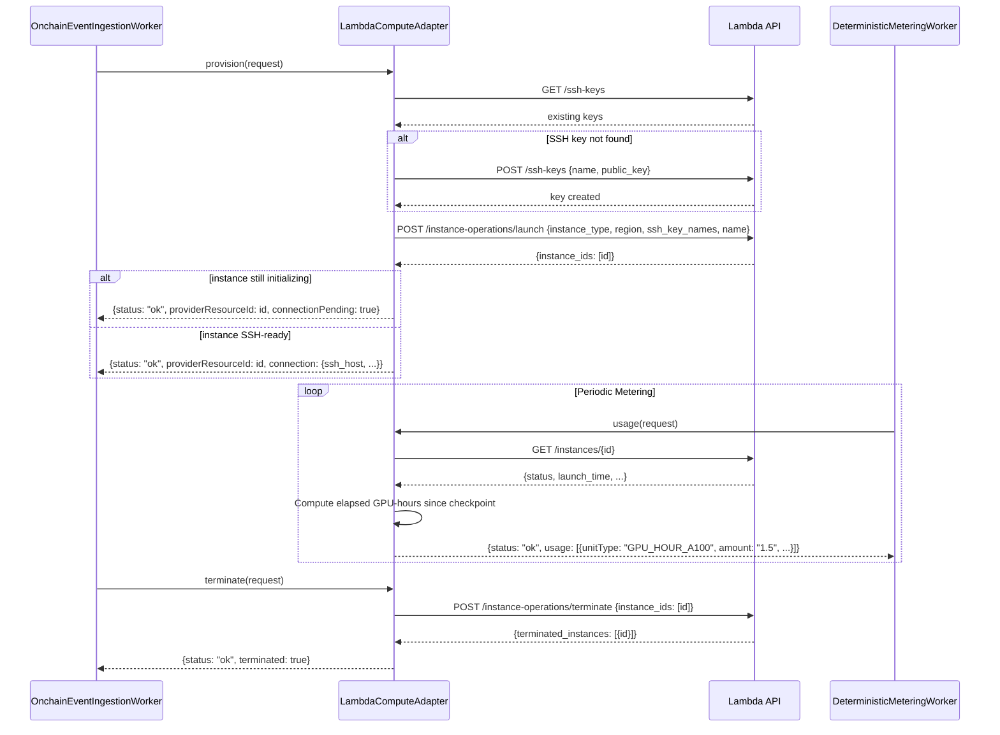
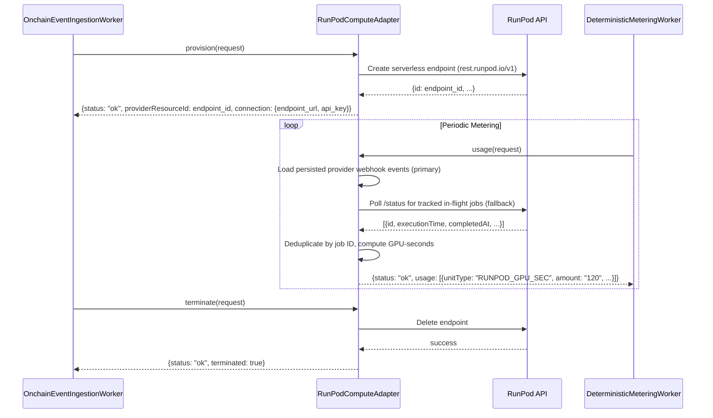

# Design Document — Synthesis Phase 3: Provider Adapters

## Overview

Phase 3 completes the two remaining compute provider adapters in the mailbox-relayer codebase and adds an adapter routing layer. After Phase 3, all four provider rails — Venice (managed API inference), Bankr (LLM gateway API inference), Lambda (dedicated GPU instances), and RunPod (serverless/burst inference + on-demand pods) — are live implementations behind the existing `ComputeProviderAdapter` interface.

The phase also introduces differential accounting tests and no-lock-in acceptance gates that prove canonical debt outcomes are provider-agnostic.

### Design Decisions

1. **Same `ComputeProviderAdapter` interface** — Lambda and RunPod implement the identical `provision`/`usage`/`terminate` interface that the existing API-inference adapters (Venice and Bankr) already use. No interface changes.
2. **HTTP-based adapters with injectable `fetch`** — Both adapters follow the Venice pattern: constructor accepts options + `fetchFn` for testability. Lambda uses REST; RunPod uses two REST surfaces: serverless (`api.runpod.ai/v2`) and infrastructure (`rest.runpod.io/v1`).
3. **Adapter Router as registry extension** — The existing `ComputeAdapterRegistry` gains a `resolve(policy)` method. No new class; the router logic lives in the registry.
4. **Canonical unit type registry** — A shared `unit-types.ts` module defines all canonical unit types and their provider-specific mappings. All adapters import from this single source.
5. **Deterministic runtime metering for Lambda** — Lambda doesn't expose per-instance billing APIs. The adapter computes GPU-hours from `launch_time` to checkpoint boundary, using the instance type's known hourly rate.
6. **RunPod dual mode** — RunPod supports both serverless endpoints (burst inference) and on-demand pods (dedicated capacity). The adapter selects mode based on `policy.computeMode`.
7. **Differential tests use mocked adapters** — Tests inject mock `fetchFn` implementations that return synthetic provider responses. No live API calls in CI.

### Out of Scope

- Modifications to Phase 1 Diamond facets or storage layout
- Large redesign of EventListener or TransactionSubmitter (Phase 2); only minimal webhook-ingestion wiring is allowed
- Modifications to existing API-inference adapters (`VeniceComputeAdapter`, `BankrComputeAdapter`)
- ERC-8004 / ERC-8183 integration (Phase 4)
- Production mainnet deployment
- Modal or Vast provider integrations

---

## Architecture

### Provider Adapter Decomposition

```mermaid
graph TB
    subgraph Registry ["ComputeAdapterRegistry"]
        R[resolve&#40;policy&#41;]
        R --> |provider: lambda| LA[LambdaComputeAdapter]
        R --> |provider: runpod| RA[RunPodComputeAdapter]
        R --> |provider: venice| VA[VeniceComputeAdapter]
        R --> |provider: bankr| BA[BankrComputeAdapter]
        R --> |computeMode: dedicated| LA
        R --> |computeMode: burst| RA
        R --> |computeMode: api_inference| VA
    end

    subgraph Lambda ["Lambda Labs API"]
        LA --> |POST /instance-operations/launch| LI[Instance Lifecycle]
        LA --> |GET /instances/:id| LU[Instance Status/Metering]
        LA --> |POST /instance-operations/terminate| LT[Instance Termination]
        LA --> |POST /ssh-keys| LK[SSH Key Management]
    end

    subgraph RunPod ["RunPod API"]
        RA --> |POST api.runpod.ai/v2/:endpoint/run| RS[Serverless Inference]
        RA --> |POST rest.runpod.io/v1/pods| RP[Pod Lifecycle]
        RA --> |GET rest.runpod.io/v1/pods/:id| RU[Pod Status/Metering]
        RA --> |DELETE rest.runpod.io/v1/pods/:id| RT[Pod Termination]
        RA --> |DELETE rest.runpod.io/v1/endpoints/:id| RE[Endpoint Termination]
    end

    subgraph Shared
        UT[unit-types.ts<br/>Canonical Unit Registry]
        CP[ComputePolicy Schema]
    end

    LA -.-> UT
    RA -.-> UT
    VA -.-> UT
    R -.-> CP
```



### Lambda Adapter Flow (Provision → Meter → Terminate)



### RunPod Adapter Flow — Serverless Mode



---

## Components and Interfaces

### LambdaComputeAdapter

```typescript
interface LambdaAdapterOptions {
  apiKey?: string;
  baseUrl?: string;
  fetchFn?: typeof fetch;
}

export class LambdaComputeAdapter implements ComputeProviderAdapter {
  readonly provider = 'lambda' as const;

  constructor(options?: LambdaAdapterOptions);

  /** Provision a dedicated GPU instance */
  provision(request: ProvisionRequest): Promise<ProvisionResult>;

  /** Meter runtime usage for a provisioned instance */
  usage(request: UsageRequest): Promise<UsageResult>;

  /** Terminate a provisioned instance */
  terminate(request: TerminateRequest): Promise<TerminateResult>;

  /** List supported instance type mappings */
  getSupportedInstanceTypes(): Record<string, string>;
}
```

Lambda API endpoints used:
- `GET /ssh-keys` — list existing SSH keys
- `POST /ssh-keys` — create SSH key `{name, public_key}`
- `POST /instance-operations/launch` — launch instance `{region_name, instance_type_name, ssh_key_names, name, quantity}`
- `GET /instances/{id}` — get instance details (status, ip, launch_time)
- `GET /instances` — list all instances (fallback for status)
- `POST /instance-operations/terminate` — terminate instances `{instance_ids}`

### Instance Type Mapping

| Canonical ID | Lambda Instance Type | GPU |
|---|---|---|
| `a100_40gb` | `gpu_1x_a100` | 1× A100 40GB |
| `a100_80gb` | `gpu_1x_a100_sxm4` | 1× A100 80GB SXM4 |
| `a100_80gb_2x` | `gpu_2x_a100` | 2× A100 80GB |
| `h100_80gb` | `gpu_1x_h100_pcie` | 1× H100 80GB PCIe |
| `h100_sxm_80gb` | `gpu_1x_h100_sxm5` | 1× H100 80GB SXM5 |
| `a10_24gb` | `gpu_1x_a10` | 1× A10 24GB |

If `policy.instanceType` is already a valid Lambda type string (starts with `gpu_`), it is used directly.

### RunPodComputeAdapter

```typescript
interface RunPodAdapterOptions {
  apiKey?: string;
  serverlessBaseUrl?: string;
  infraBaseUrl?: string;
  fetchFn?: typeof fetch;
}

export class RunPodComputeAdapter implements ComputeProviderAdapter {
  readonly provider = 'runpod' as const;

  constructor(options?: RunPodAdapterOptions);

  /** Provision a serverless endpoint or on-demand pod */
  provision(request: ProvisionRequest): Promise<ProvisionResult>;

  /** Meter inference usage (serverless) or runtime usage (pod) */
  usage(request: UsageRequest): Promise<UsageResult>;

  /** Terminate endpoint or pod */
  terminate(request: TerminateRequest): Promise<TerminateResult>;
}
```

RunPod API endpoints used:
- Serverless (`https://api.runpod.ai/v2`): `POST /{endpoint_id}/run`, `POST /{endpoint_id}/runsync`, `GET /{endpoint_id}/status/{job_id}`
- Infrastructure (`https://rest.runpod.io/v1`): `POST /endpoints`, `DELETE /endpoints/{id}`, `POST /pods`, `GET /pods/{id}`, `DELETE /pods/{id}`

### Adapter Router (Registry Extension)

```typescript
import { z } from 'zod';

export const computePolicySchema = z.object({
  provider: z.enum(['lambda', 'runpod', 'venice', 'bankr']).optional(),
  computeMode: z.enum(['dedicated', 'burst', 'api_inference']).optional(),
  instanceType: z.string().optional(),
  region: z.string().optional(),
  model: z.string().optional(),
  maxWorkers: z.number().int().positive().optional(),
  minWorkers: z.number().int().nonnegative().optional(),
  idleTimeout: z.number().int().positive().optional(),
  executionTimeoutMs: z.number().int().positive().optional(),
  jobTtlMs: z.number().int().positive().optional(),
  webhookUrl: z.string().url().optional(),
  sshPublicKey: z.string().optional(),
  consumptionLimit: z.record(z.unknown()).optional(),
});

export type ComputePolicy = z.infer<typeof computePolicySchema>;

/** Default routing: computeMode → provider */
const MODE_TO_PROVIDER: Record<string, ComputeProvider> = {
  dedicated: 'lambda',
  burst: 'runpod',
  api_inference: 'venice',
};

export class ComputeAdapterRegistry {
  // ... existing register/get/list methods ...

  /** Resolve the adapter for a given compute policy */
  resolve(policy: ComputePolicy): ComputeProviderAdapter | undefined;

  /** Disable a provider (operational circuit-breaker) */
  disable(provider: ComputeProvider): void;

  /** Re-enable a disabled provider */
  enable(provider: ComputeProvider): void;

  /** Check if a provider is enabled */
  isEnabled(provider: ComputeProvider): boolean;
}
```

Routing logic:
1. If `policy.provider` is set → use that provider directly
2. Else if `policy.computeMode` is set → use `MODE_TO_PROVIDER[computeMode]`
3. Else → return `undefined` (caller rejects)
4. If resolved provider is disabled → return `undefined`

### Canonical Unit Type Registry

```typescript
// src/providers/unit-types.ts

export interface CanonicalUnitType {
  id: string;
  name: string;
  providerMappings: Partial<Record<ComputeProvider, string[]>>;
}

export const CANONICAL_UNIT_TYPES: CanonicalUnitType[] = [
  // Lambda GPU-hour types
  { id: 'GPU_HOUR_A100', name: 'A100 GPU Hour', providerMappings: { lambda: ['gpu_1x_a100', 'gpu_1x_a100_sxm4'] } },
  { id: 'GPU_HOUR_H100', name: 'H100 GPU Hour', providerMappings: { lambda: ['gpu_1x_h100_pcie', 'gpu_1x_h100_sxm5'] } },
  { id: 'GPU_HOUR_A10', name: 'A10 GPU Hour', providerMappings: { lambda: ['gpu_1x_a10'] } },

  // RunPod types
  { id: 'RUNPOD_GPU_SEC', name: 'RunPod GPU Second', providerMappings: { runpod: ['gpu_second'] } },
  { id: 'RUNPOD_INFERENCE_REQUEST', name: 'RunPod Inference Request', providerMappings: { runpod: ['inference_request'] } },

  // Venice types (already defined in Venice adapter)
  { id: 'VENICE_TEXT_TOKEN_IN', name: 'Venice Text Input Token', providerMappings: { venice: ['input', 'prompt'] } },
  { id: 'VENICE_TEXT_TOKEN_OUT', name: 'Venice Text Output Token', providerMappings: { venice: ['output', 'completion'] } },
  { id: 'VENICE_IMAGE_GEN', name: 'Venice Image Generation', providerMappings: { venice: ['image'] } },
  { id: 'VENICE_AUDIO_TTS_CHAR', name: 'Venice TTS Character', providerMappings: { venice: ['tts', 'char'] } },
  { id: 'VENICE_AUDIO_STT_SEC', name: 'Venice STT Second', providerMappings: { venice: ['stt', 'audio_sec', 'second'] } },

  // Bankr types
  { id: 'BANKR_TEXT_TOKEN_IN', name: 'Bankr Text Input Token', providerMappings: { bankr: ['input', 'prompt'] } },
  { id: 'BANKR_TEXT_TOKEN_OUT', name: 'Bankr Text Output Token', providerMappings: { bankr: ['output', 'completion'] } },
];

/** Look up canonical unit type for a provider-specific metric */
export function resolveCanonicalUnitType(provider: ComputeProvider, providerMetric: string): string | undefined;

/** Get all canonical unit types for a provider */
export function getProviderUnitTypes(provider: ComputeProvider): string[];
```

---

## Data Models

### Lambda Instance Metering State

The Lambda adapter computes usage from instance runtime. No new SQLite tables are needed — the existing `provider_links` table stores `providerResourceId` (instance ID), and the existing `usage_checkpoints` table stores the last metering timestamp.

Runtime calculation:
```
elapsedHours = (checkpointEnd - max(launchTime, checkpointStart)) / 3600
unitType = instanceTypeToCanonicalUnit(instanceType)  // e.g., "GPU_HOUR_A100"
amount = elapsedHours.toFixed(18)  // decimal string
```

### RunPod Serverless Metering State

For serverless endpoints, metering is webhook-first with polling fallback:
```
// 1) Read persisted completion events ingested by Phase 2 provider-event ingress
// 2) Poll /status for tracked in-flight jobs before retention expiry

// Per-request metering
unitType = "RUNPOD_INFERENCE_REQUEST"
amount = completedJobCount.toString()

// GPU-second metering (if execution time available)
unitType = "RUNPOD_GPU_SEC"
amount = totalExecutionSeconds.toFixed(18)
```

Job deduplication uses job ID as the canonical event key and persists digest state in `usage_checkpoints.lastUsageDigest`.

### RunPod Pod Metering State

For on-demand pods, metering mirrors Lambda:
```
elapsedHours = (checkpointEnd - max(podStartTime, checkpointStart)) / 3600
unitType = "GPU_HOUR_{gpuType}"  // derived from pod GPU config
amount = elapsedHours.toFixed(18)
```

### Environment Variables (New)

| Variable | Required | Default | Used By |
|---|---|---|---|
| `LAMBDA_API_KEY` | For Lambda ops | — | LambdaComputeAdapter |
| `LAMBDA_BASE_URL` | No | `https://cloud.lambdalabs.com/api/v1` | LambdaComputeAdapter |
| `RUNPOD_API_KEY` | For RunPod ops | — | RunPodComputeAdapter |
| `RUNPOD_SERVERLESS_BASE_URL` | No | `https://api.runpod.ai/v2` | RunPodComputeAdapter |
| `RUNPOD_INFRA_BASE_URL` | No | `https://rest.runpod.io/v1` | RunPodComputeAdapter |

These are optional — the relayer starts without them, and the adapters return `{status: "error", message: "..._API_KEY not configured"}` when called without credentials.

Existing Bankr environment variables (`BANKR_LLM_KEY`, `BANKR_LLM_BASE_URL`, optional `BANKR_KEY_POOL_*`) remain unchanged from Phase 1.5 and are intentionally not modified in this phase.

---

## Correctness Properties

### Property 1: Adapter interface compliance

*For all* four adapters (Lambda, RunPod, Venice, Bankr), calling `provision()`, `usage()`, and `terminate()` SHALL always return a result conforming to `ProvisionResult`, `UsageResult`, and `TerminateResult` respectively. The `status` field SHALL be one of `"ok"`, `"error"`, or `"not_implemented"`. No adapter SHALL throw an unhandled exception — all errors are caught and returned as `{status: "error"}`.

**Validates: Requirements 1.1–1.9, 4.1–4.8, existing Venice/Bankr behavior**

### Property 2: Provision idempotency (Lambda)

*For any* `ProvisionRequest` with a given `agreementId`, calling `provision()` SHALL produce a unique `providerResourceId` (instance ID). Calling `provision()` again with the same `agreementId` SHALL launch a new instance (Lambda does not deduplicate launches). The caller (ingestion worker) is responsible for not calling provision twice for the same agreement.

**Validates: Requirements 1.1, 1.4, 1.8, 1.9**

### Property 3: Provision idempotency (RunPod)

*For any* `ProvisionRequest` with a given `agreementId`, calling `provision()` SHALL produce a unique `providerResourceId` (endpoint ID or pod ID). Same caller-side deduplication responsibility as Lambda.

**Validates: Requirements 4.1, 4.4, 4.7, 4.8**

### Property 4: Termination idempotency

*For all* four adapters, calling `terminate()` on an already-terminated resource SHALL return `{status: "ok", terminated: true}`. Termination is idempotent — calling it multiple times for the same resource produces the same result without errors.

**Validates: Requirements 3.3, 6.3**

### Property 5: Usage metering determinism (Lambda)

*For any* Lambda instance with known `launch_time` and `instance_type`, and any metering window `[from, to]`, the computed usage amount SHALL be deterministic: `amount = (min(to, terminationTime) - max(from, launchTime)) / 3600` formatted as a decimal string. Two calls with the same parameters SHALL produce identical results.

**Validates: Requirements 2.1, 2.2, 2.3, 2.4**

### Property 6: Usage metering determinism (RunPod serverless)

*For any* RunPod serverless endpoint with a set of completed jobs in window `[from, to]`, the computed usage SHALL be deterministic: each job contributes exactly once (deduplicated by job ID), and the total amount is the sum of individual job metrics. Two calls with the same job set SHALL produce identical results.

**Validates: Requirements 5.1, 5.2, 5.3, 5.6**

### Property 7: Canonical unit type mapping completeness

*For all* usage rows produced by any adapter, the `unitType` field SHALL be a valid canonical unit type from the `CANONICAL_UNIT_TYPES` registry. No adapter SHALL produce a `unitType` that is not in the registry.

**Validates: Requirements 2.3, 5.2, 20.1, 20.2**

### Property 8: Adapter routing determinism

*For any* `ComputePolicy` with a given `provider` or `computeMode`, the `ComputeAdapterRegistry.resolve()` method SHALL always return the same adapter (or `undefined` if disabled/missing). The routing decision is a pure function of the policy and the registry's enabled state.

**Validates: Requirements 7.1, 7.2, 7.3, 7.4**

### Property 9: Differential accounting equivalence

*For any* synthetic workload trace with known usage amounts, replaying the trace through any two adapters (with mocked provider responses producing equivalent canonical usage) and applying the same unit pricing SHALL produce identical `principalDrawn` values. The difference SHALL be exactly zero (not approximately zero).

**Validates: Requirements 14.1, 14.2, 14.3, 14.4, 15.1, 15.2, 15.3**

### Property 10: No-lock-in core independence

*For any* single provider adapter that is disabled, all agreements routed to the remaining enabled providers SHALL produce correct accounting outcomes. Disabling an adapter SHALL not affect the `ComputeAdapterRegistry.resolve()` results for other providers. No core contract storage field references a specific provider.

**Validates: Requirements 16.1, 16.2, 16.3, 16.4, 17.1, 17.2, 17.3**

### Property 11: Error normalization consistency

*For all* API errors from Lambda and RunPod (HTTP 4xx, 5xx, network errors), the adapter SHALL return `{status: "error", message}` where `message` is a non-empty string. The adapter SHALL never return `{status: "ok"}` when the underlying API call failed.

**Validates: Requirements 9.1, 9.2, 9.3, 10.1, 10.2, 10.3, 10.4**

### Property 12: Rate limit retry correctness

*For any* HTTP 429 response from Lambda or RunPod, the adapter SHALL retry after the specified delay (or exponential backoff). *For any* HTTP 5xx response, the adapter SHALL retry up to 3 times. After exhausting retries, the adapter SHALL return `{status: "error"}` — never silently succeed or hang.

**Validates: Requirements 9.1, 9.2, 10.1, 10.2**

### Property 13: SSH key management idempotency (Lambda)

*For any* agreement ID, the SSH key name `equalfi-{agreementId}` is deterministic. If the key already exists on Lambda, `provision()` SHALL reuse it without error. If it does not exist, `provision()` SHALL create it. The key creation is idempotent with respect to the agreement.

**Validates: Requirements 11.1, 11.2, 11.3**

### Property 14: RunPod dual-mode dispatch

*For any* `ProvisionRequest` where `policy.computeMode` is `"dedicated"` and `policy.provider` is `"runpod"`, the adapter SHALL provision an on-demand pod. *For any* request where `policy.computeMode` is `"burst"` or unset, the adapter SHALL provision a serverless endpoint. The mode selection is deterministic based on the policy.

**Validates: Requirements 13.1, 13.2, 13.3, 13.4, 13.5**

---

## Error Handling

### Lambda Adapter Errors

| Error Condition | Behavior | Log Level |
|---|---|---|
| `LAMBDA_API_KEY` missing | Return `{status: "error", message}` | `warn` |
| HTTP 429 (rate limited) | Retry after `Retry-After` header delay | `warn` |
| HTTP 5xx | Retry up to 3 times with exponential backoff | `warn` |
| HTTP 4xx (client error) | Return `{status: "error", message}` with API error detail | `error` |
| Instance type not mappable | Return `{status: "error", message: "unsupported_instance_type"}` | `error` |
| SSH key creation failure | Return `{status: "error", message}`, do not proceed to launch | `error` |
| Instance not found (usage/terminate) | Return usage up to last known state / return `{terminated: true}` | `warn` |
| Network error | Return `{status: "error", message}` | `error` |

### RunPod Adapter Errors

| Error Condition | Behavior | Log Level |
|---|---|---|
| `RUNPOD_API_KEY` missing | Return `{status: "error", message}` | `warn` |
| HTTP 429 (rate limited) | Retry with exponential backoff | `warn` |
| HTTP 5xx | Retry up to 3 times with exponential backoff | `warn` |
| REST error payload | Extract provider message/request ID, return `{status: "error", message}` | `error` |
| Webhook events delayed/missing | Use `/status` fallback for tracked in-flight jobs before retention expiry | `warn` |
| Endpoint/pod not found | Return `{terminated: true}` for terminate, `{usage: []}` for usage | `warn` |
| Network error | Return `{status: "error", message}` | `error` |

### Retry Strategy

| Adapter | Trigger | Strategy | Max Retries |
|---|---|---|---|
| Lambda | HTTP 429 | Wait `Retry-After` seconds (or 5s default) | 3 |
| Lambda | HTTP 5xx | Exponential backoff: 1s, 2s, 4s | 3 |
| RunPod | HTTP 429 | Exponential backoff: 1s, 2s, 4s | 3 |
| RunPod | HTTP 5xx | Exponential backoff: 1s, 2s, 4s | 3 |

---

## Testing Strategy

### Unit Tests

- Lambda provision: mock API responses for SSH key check, key creation, instance launch (success + error cases)
- Lambda usage: mock instance status responses, verify GPU-hour calculation for various time windows
- Lambda terminate: mock terminate response, verify idempotent behavior for already-terminated instances
- Lambda instance type mapping: verify canonical → Lambda type conversion and direct passthrough
- Lambda SSH key management: verify idempotent key creation
- Lambda rate limit retry: mock 429 responses, verify retry with backoff
- RunPod serverless provision: mock endpoint creation response
- RunPod serverless usage: mock webhook event ingestion + `/status` fallback, verify deduplication and GPU-second calculation
- RunPod pod provision: mock infrastructure REST pod creation response
- RunPod pod usage: mock pod status, verify GPU-hour calculation
- RunPod terminate: mock endpoint/pod deletion, verify idempotent behavior
- RunPod REST error normalization: mock error bodies + request IDs
- Adapter router: verify policy → provider resolution for all combinations
- Adapter router: verify disable/enable circuit-breaker behavior
- Compute policy schema: verify validation accepts valid policies, rejects invalid
- Canonical unit type registry: verify lookup and provider mapping

### Differential Tests

- Venice vs Lambda: replay synthetic workload trace, assert identical `principalDrawn`
- Bankr vs Lambda: replay synthetic workload trace, assert identical `principalDrawn`
- Venice vs RunPod: replay synthetic workload trace, assert identical `principalDrawn`
- Bankr vs RunPod: replay synthetic workload trace, assert identical `principalDrawn`
- Lambda vs RunPod: replay synthetic workload trace, assert identical `principalDrawn`

### No-Lock-In Acceptance Tests

- Disable Lambda → verify Venice + Bankr + RunPod accounting correct
- Disable RunPod → verify Venice + Bankr + Lambda accounting correct
- Disable Venice → verify Bankr + Lambda + RunPod accounting correct
- Disable Bankr → verify Venice + Lambda + RunPod accounting correct
- Verify no provider-specific fields in Diamond storage layout
- Verify no provider-specific columns in SQLite schema
- Verify provider swap requires only policy change

### Property-Based Tests

- Canonical unit type mapping completeness (Property 7): fuzz provider metrics, verify all map to registry
- Adapter routing determinism (Property 8): fuzz policies, verify deterministic resolution
- Usage metering determinism (Properties 5, 6): fuzz time windows and job sets, verify deterministic output

### Test Organization

```
test/
├── providers/
│   ├── lambda.test.ts              — Lambda adapter unit tests
│   ├── runpod.test.ts              — RunPod adapter unit tests
│   ├── registry.test.ts            — Adapter router + policy resolution
│   ├── unit-types.test.ts          — Canonical unit type registry
│   ├── venice.test.ts              — (existing)
│   └── bankr.test.ts               — (existing)
├── differential/
│   ├── venice-vs-lambda.test.ts    — Differential accounting
│   ├── bankr-vs-lambda.test.ts     — Differential accounting
│   ├── venice-vs-runpod.test.ts    — Differential accounting
│   ├── bankr-vs-runpod.test.ts     — Differential accounting
│   └── lambda-vs-runpod.test.ts    — Differential accounting
├── acceptance/
│   ├── no-lock-in.test.ts          — No-lock-in acceptance gates
│   └── storage-independence.test.ts — Storage independence verification
└── property/
    ├── unit-type-mapping.test.ts   — Property 7
    ├── routing-determinism.test.ts — Property 8
    └── metering-determinism.test.ts — Properties 5, 6
```

### Key Test Scenarios

1. **Lambda full lifecycle**: provision instance → meter 2 hours runtime → terminate → verify usage = 2.0 GPU-hours
2. **RunPod serverless lifecycle**: provision endpoint → submit 10 inference jobs → meter → terminate → verify usage = 10 requests + GPU-seconds
3. **RunPod pod lifecycle**: provision pod → meter 1.5 hours → terminate → verify usage = 1.5 GPU-hours
4. **Adapter routing matrix**: test all 12 combinations of `{provider} × {computeMode}` plus missing/invalid values
5. **Differential trace replay**: 100 usage events normalized through Venice/Bankr and Lambda, assert zero debt difference
6. **Rate limit resilience**: mock 3 consecutive 429s then success, verify adapter retries and succeeds
7. **Webhook retention safety**: async completion arrives via webhook after `/run`; verify metering still captures usage even when polling window alone would miss short-lived result retention
8. **SSH key idempotency**: provision twice with same agreementId, verify key created once and reused
9. **Disable/enable circuit breaker**: disable Lambda, verify resolve returns undefined for Lambda policies, re-enable, verify resolve works again
