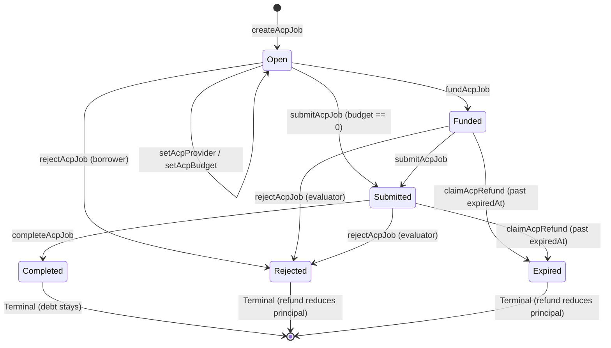
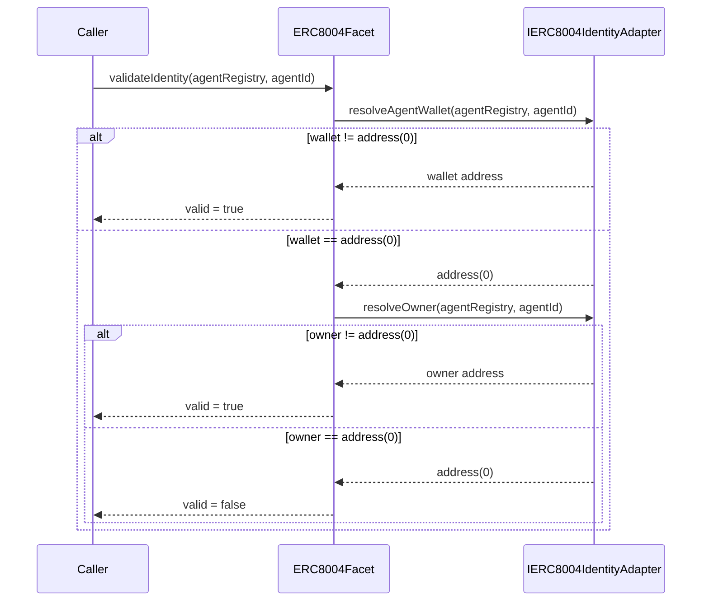
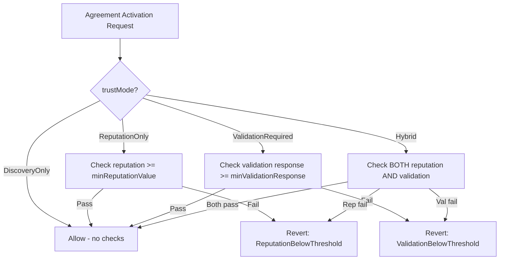
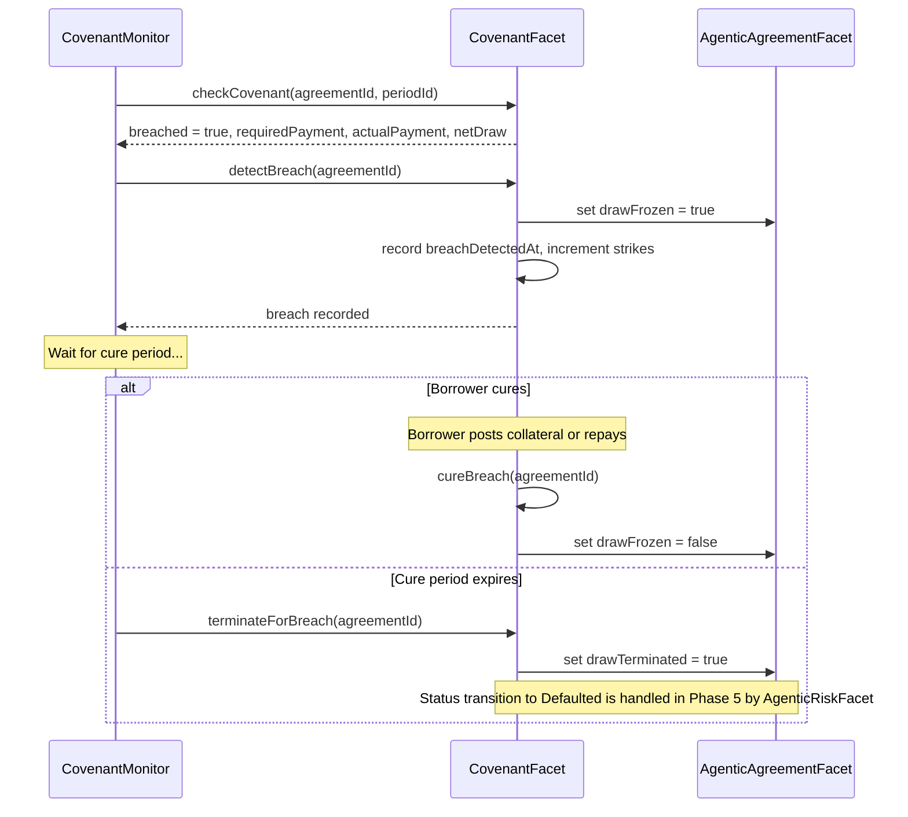
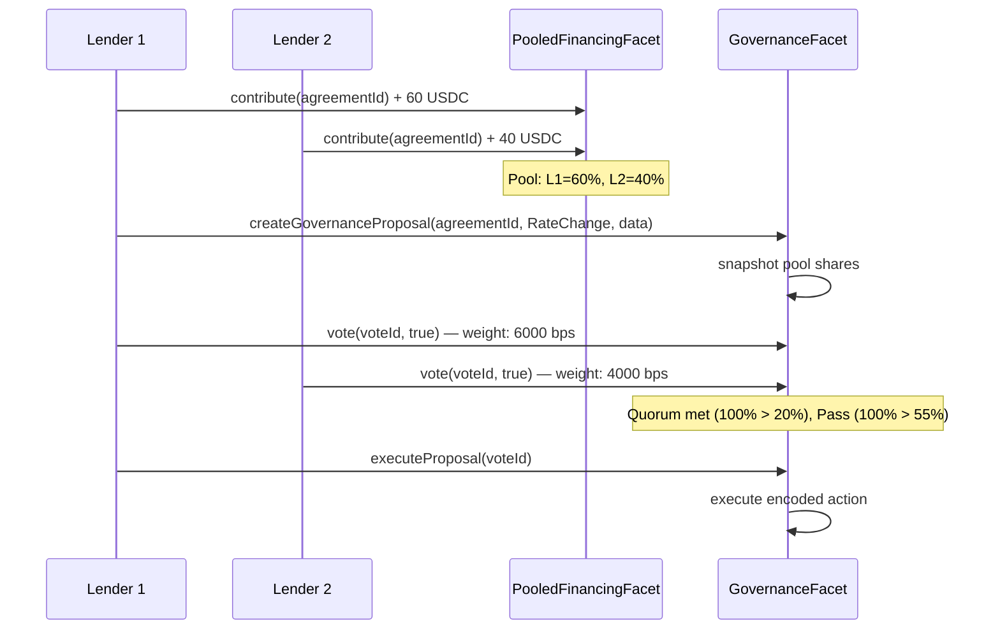

# Design Document — Synthesis Phase 4: Agentic Financing Advanced Features

## Overview

Phase 4 completes the Equalis Agentic Financing canonical specification by adding seven new on-chain facet subsystems and two off-chain schedulers to the existing Diamond architecture. Building on Phase 1 (core proposal/agreement/accounting), Phase 2 (event infrastructure), and Phase 3 (compute provider adapters), Phase 4 delivers:

1. **ERC-8004 Integration** — Identity resolution via `getAgentWallet` → `ownerOf` fallback, trust mode gating (DiscoveryOnly/ReputationOnly/ValidationRequired/Hybrid), reputation feedback, and validation request/recording
2. **ERC-8183 Integration** — Full ACP job lifecycle (create → setProvider/setBudget → fund → submit → complete/reject/expire) with terminal state accounting synchronization
3. **ACP Adapter Registry** — `venueKey → adapter` routing with enable/disable circuit-breaking and per-agreement venue assignment
4. **Reference8183Adapter + MockGeneric8183Adapter** — Two concrete `IACP8183Adapter` implementations for portability verification
5. **Collateral Management** — Optional collateral posting, release, seizure with toggle semantics and maintenance ratio enforcement
6. **Net Draw Coverage Covenants** — Periodic payment-vs-net-draw enforcement with breach detection, draw freeze, cure period, and draw termination hand-off to Phase 5 risk transitions
7. **Interest Accrual + Fee Schedules** — Linear interest computation, fee waterfall, and pending interest queries
8. **Pooled Financing + Governance** — Multi-lender capital pooling with on-chain governance (proposal, vote, execute, quorum config)
9. **Off-Chain Schedulers** — Interest accrual scheduler and covenant compliance monitor

All new facets are additive — no breaking modifications to existing Phase 1 storage layout/behavior, Phase 2 event infrastructure, or Phase 3 compute adapters. Additive storage needed for Phase 4 is in scope.

### Cross-Chain Note (Arbitrum Deploy + Base ERC-8004)

The ERC-8004 integration described in Phase 4 is **on-chain** and therefore assumes the ERC-8004 registry/adapters are deployed on the same chain as the Diamond.

If the Diamond is deployed on Arbitrum while ERC-8004 identity lives on Base, Phase 4 ERC-8004 gating cannot be made correct without an oracle/bridge/cross-chain verification scheme.

Deployment modes:
- Same-chain mode (Diamond + ERC-8004 registry/adapters co-located): on-chain ERC-8004 gating applies.
- Cross-chain hackathon mode: prefer the **Phase 2 offchain resolver** to gate provisioning/publishProviderPayload at the relayer level until a dedicated on-chain bridge/oracle exists.

### Design Decisions

1. **Diamond facet decomposition** — Each subsystem maps to a dedicated facet (ERC8004Facet, ERC8183Facet, AdapterRegistryFacet, CollateralManagerFacet, CovenantFacet, InterestFacet, PooledFinancingFacet, GovernanceFacet). Libraries handle shared logic.
2. **Adapter registry pattern mirrors Phase 3** — The on-chain `AdapterRegistryFacet` uses the same `venueKey → adapter` pattern as the off-chain `ComputeAdapterRegistry`, but with `bytes32` keys and Solidity storage.
3. **Terminal state finality via guard mapping** — `acpJobTerminalState[jobId]` is a one-write field. Once non-zero, all state-transition functions revert with `JobAlreadyTerminal`. This prevents accounting replay.
4. **Covenant uses period payment accounting** — Covenant evaluation is based on period `requiredPayment` vs `actualPayment` with `netDraw` inputs per canonical Section 4.11.
5. **Interest uses linear accrual** — v1.11 baseline uses linear checkpoint accrual with standard `uint256` arithmetic and `SECONDS_PER_YEAR = 365.25 * 86400`.
6. **Off-chain schedulers follow the `UsageSettlementScheduler` pattern** — Both the interest accrual scheduler and covenant monitor use the same `setInterval` + `isRunning` guard pattern from Phase 3's settlement scheduler.
7. **Governance snapshots pool shares at proposal creation** — Vote weight is determined by pool share at snapshot time, preventing flash-contribution attacks.
8. **Refund liveness is non-pausable** — `claimAcpRefund` bypasses circuit breaker pause state per canonical spec Section 10.3.

### Out of Scope

- Breaking modifications to Phase 1 Diamond facet behavior or existing storage layout
- Modifications to Phase 2 EventListener or TransactionSubmitter
- Modifications to Phase 3 compute provider adapters (Lambda, RunPod, Venice, Bankr)
- Delinquency/default/write-off status transitions (owned by Phase 5 AgenticRiskFacet)
- Frontend or UI components
- Production mainnet deployment or HSM/KMS key management
- Token economics beyond the fee/interest model defined in canonical spec
- Module mirror bridge from native encumbrance state (optional, non-canonical)

---

## Architecture

### Facet Decomposition

```mermaid
graph TB
    subgraph Diamond ["Equalis Diamond Proxy"]
        subgraph Phase1 ["Phase 1 (Existing)"]
            APF[AgenticProposalFacet]
            AAF[AgenticApprovalFacet]
            AGF[AgenticAgreementFacet]
            CUF[ComputeUsageFacet]
        end

        subgraph Phase4 ["Phase 4 (New)"]
            E8004[ERC8004Facet]
            E8183[ERC8183Facet]
            ARF[AdapterRegistryFacet]
            CMF[CollateralManagerFacet]
            CVF[CovenantFacet]
            IF[InterestFacet]
            PFF[PooledFinancingFacet]
            GF[GovernanceFacet]
        end
    end

    subgraph Adapters ["External Adapters"]
        RA[Reference8183Adapter]
        MA[MockGeneric8183Adapter]
        IA[IERC8004IdentityAdapter]
        RPA[IERC8004ReputationAdapter]
        VDA[IERC8004ValidationAdapter]
    end

    subgraph OffChain ["Off-Chain Schedulers"]
        IAS[InterestAccrualScheduler]
        CM[CovenantMonitor]
    end

    ARF -->|venueKey routing| RA
    ARF -->|venueKey routing| MA
    E8183 -->|resolve adapter| ARF
    E8183 -->|lifecycle calls| RA
    E8183 -->|lifecycle calls| MA
    E8004 -->|identity| IA
    E8004 -->|reputation| RPA
    E8004 -->|validation| VDA
    CVF -->|draw freeze| AGF
    CMF -->|collateral ratio| CVF
    PFF -->|pool shares| GF
    IAS -->|accrueInterest| IF
    CM -->|checkCovenant/detectBreach| CVF
```



### ACP Job Lifecycle State Machine



### ERC-8004 Identity Resolution Flow



### Trust Mode Gating Flow



### Covenant Breach → Cure/Termination Flow



### Pooled Financing + Governance Flow



---

## Components and Interfaces

### ERC8004Facet

```solidity
contract ERC8004Facet {
    // Admin configuration
    function setERC8004Registry(address registry) external; // Admin_Role only
    function getERC8004Registry() external view returns (address);

    // Identity resolution
    function validateIdentity(string calldata agentRegistry, uint256 agentId) external view returns (bool valid);
    function requireIdentity(string calldata agentRegistry, uint256 agentId) external view; // reverts with IdentityNotResolved

    // Trust mode configuration
    function setTrustProfile(
        uint256 agreementId,
        TrustMode trustMode,
        int128 minReputationValue,
        uint8 minReputationValueDecimals,
        address requiredValidator,
        uint8 minValidationResponse
    ) external; // emits TrustProfileSet

    // Trust mode gating (called during activation)
    function checkTrustRequirements(uint256 agreementId, address borrower) external view returns (bool);

    // Reputation feedback
    function submitReputationFeedback(
        uint256 agreementId,
        address counterparty,
        int128 score,
        string calldata comment
    ) external; // emits ReputationFeedbackPosted

    // Validation
    function requestValidation(uint256 agreementId) external; // emits ValidationRequested
    function checkValidationStatus(uint256 agreementId) external; // emits ValidationRecorded
}
```

### ERC8183Facet

```solidity
contract ERC8183Facet {
    // Job lifecycle
    function createAcpJob(
        uint256 agreementId,
        bytes32 venueKey,
        address provider,
        address evaluator,
        uint256 expiredAt,
        string calldata description,
        address hook
    ) external returns (uint256 acpJobId);

    function setAcpProvider(uint256 jobId, address provider) external;
    function setAcpBudget(uint256 jobId, uint256 budget, bytes calldata optParams) external;
    function fundAcpJob(uint256 jobId, bytes calldata optParams) external;
    function submitAcpJob(uint256 jobId, bytes32 result, bytes calldata optParams) external;
    function completeAcpJob(uint256 jobId, bytes32 reason, bytes calldata optParams) external;
    function rejectAcpJob(uint256 jobId, bytes32 reason, bytes calldata optParams) external;
    function claimAcpRefund(uint256 jobId) external; // non-pausable

    // Views
    function getAcpJob(uint256 jobId) external view returns (AcpJobInfo memory);
    function getAgreementJobs(uint256 agreementId) external view returns (uint256[] memory);
}
```

### AdapterRegistryFacet

```solidity
contract AdapterRegistryFacet {
    function registerVenueAdapter(bytes32 venueKey, address adapter) external; // Admin_Role
    function setVenueEnabled(bytes32 venueKey, bool enabled) external; // Admin_Role
    function getVenueAdapter(bytes32 venueKey) external view returns (address adapter, bool enabled);

    function setAgreementVenue(uint256 agreementId, bytes32 venueKey) external;
    function getAgreementVenue(uint256 agreementId) external view returns (bytes32 venueKey, address adapter);
}
```

### IACP8183Adapter (Canonical Interface)

```solidity
interface IACP8183Adapter {
    function createJob(uint256 agreementId, address provider, address evaluator, uint256 expiredAt, string calldata description, address hook) external returns (uint256 acpJobId);
    function setProviderJob(uint256 agreementId, uint256 acpJobId, address provider) external;
    function setBudgetJob(uint256 agreementId, uint256 acpJobId, uint256 budget, bytes calldata optParams) external;
    function fundJob(uint256 agreementId, uint256 acpJobId, bytes calldata optParams) external;
    function submitJob(uint256 agreementId, uint256 acpJobId, bytes32 deliverable, bytes calldata optParams) external;
    function completeJob(uint256 agreementId, uint256 acpJobId, bytes32 reason, bytes calldata optParams) external;
    function rejectJob(uint256 agreementId, uint256 acpJobId, bytes32 reason, bytes calldata optParams) external;
    function claimRefund(uint256 agreementId, uint256 acpJobId) external;
}
```

### Reference8183Adapter

```solidity
contract Reference8183Adapter is IACP8183Adapter, ReentrancyGuard {
    // Implements full IACP8183Adapter interface
    // Isolates venue-specific integration logic for a neutral ERC-8183 reference implementation
    // Venue target is registry-configurable; local ERC-8183 reference contract is test/dev default only
    // CEI pattern + reentrancy guards on all state-mutating entry points
    // Only approved core facets can call mutating functions
    // Idempotent sync: repeated state-sync calls produce no additional accounting effects
    // Preserves Open/Funded/Submitted lifecycle semantics from ERC-8183 reference
    // Passes through optParams and hook semantics to venue implementation
    // Terminal finality: once canonical terminal state recorded, no backward transitions
    // Persists canonical reason hash from terminal transitions

    // Adapter-local storage
    mapping(uint256 => VenueLink) public venueLinks;
    mapping(uint256 => SyncStamp) public syncStamps;
}
```

### MockGeneric8183Adapter

```solidity
contract MockGeneric8183Adapter is IACP8183Adapter {
    // Implements full IACP8183Adapter with in-memory/simple storage job tracking
    // Produces identical accounting outcomes as Reference8183Adapter
    // Supports all terminal state transitions with same refund semantics
    // Usable as drop-in replacement via adapter registry

    mapping(uint256 => MockJobState) public jobs;
    uint256 public nextJobId;
}
```

### CollateralManagerFacet

```solidity
contract CollateralManagerFacet {
    function postCollateral(uint256 agreementId, address token, uint256 amount) external payable;
    function releaseCollateral(uint256 agreementId, uint256 amount) external;
    function seizeCollateral(uint256 agreementId, uint256 amount, address recipient) external;
    function setCollateralRequired(uint256 agreementId, bool required) external;
    function getCollateral(uint256 agreementId) external view returns (
        bool collateralEnabled, address collateralAsset, uint256 collateralPosted,
        uint256 collateralSeized, uint16 minCollateralRatioBps,
        uint16 maintenanceCollateralRatioBps, uint256 currentRatioBps
    );
}
```

### CovenantFacet

```solidity
contract CovenantFacet {
    function setCovenantParams(uint256 agreementId, uint16 minNetDrawCoverageBps, uint256 principalFloorPerPeriod, uint32 covenantCurePeriod) external;
    function checkCovenant(uint256 agreementId, uint256 periodId) external view returns (bool breached, uint256 requiredPayment, uint256 actualPayment, uint256 netDraw);
    function detectBreach(uint256 agreementId) external;
    function cureBreach(uint256 agreementId) external;
    function terminateForBreach(uint256 agreementId) external;
}
```

### InterestFacet

```solidity
contract InterestFacet {
    function setInterestParams(uint256 agreementId, uint16 annualRateBps) external;
    function accrueInterest(uint256 agreementId) external;
    function pendingInterest(uint256 agreementId) external view returns (uint256 totalOwed);
    function setFeeSchedule(uint256 agreementId, uint16 originationFeeBps, uint16 serviceFeeBps, uint16 lateFeeBps) external;
}
```

### PooledFinancingFacet

```solidity
contract PooledFinancingFacet {
    function enablePooledFinancing(uint256 proposalId) external;
    function contribute(uint256 agreementId) external;
    function withdraw(uint256 agreementId, uint256 amount) external;
    function getPoolShares(uint256 agreementId) external view returns (PoolShare[] memory);
    function distributeRepayment(uint256 agreementId, uint256 amount) external;
}
```

### GovernanceFacet

```solidity
contract GovernanceFacet {
    function createGovernanceProposal(uint256 agreementId, ProposalType proposalType, bytes calldata data) external returns (uint256 voteId);
    function vote(uint256 voteId, bool support) external;
    function executeProposal(uint256 voteId) external;
    function setQuorum(uint16 quorumBps) external; // Admin_Role
    function setPassThreshold(uint16 passThresholdBps) external; // Admin_Role
}
```

### Off-Chain: InterestAccrualScheduler

```typescript
export class InterestAccrualScheduler {
    private timer: NodeJS.Timeout | undefined;
    private isRunning = false;

    constructor(
        private readonly provider: ethers.Provider,
        private readonly signer: ethers.Signer,
        private readonly interestFacetAddress: string,
        private readonly intervalMs: number = 3_600_000, // 1 hour default
        private readonly accrualThresholdSeconds: number = 3600,
        private readonly onError: (error: unknown) => void
    ) {}

    start(): boolean;
    stop(): boolean;
    status(): { enabled: boolean; running: boolean; intervalMs: number };

    // Core loop: query active agreements, filter by lastAccrualAt threshold, call accrueInterest
    private async runCycle(): Promise<void>;
}
```

### Off-Chain: CovenantMonitor

```typescript
export class CovenantMonitor {
    private timer: NodeJS.Timeout | undefined;
    private isRunning = false;

    constructor(
        private readonly provider: ethers.Provider,
        private readonly signer: ethers.Signer,
        private readonly covenantFacetAddress: string,
        private readonly intervalMs: number = 900_000, // 15 min default
        private readonly onError: (error: unknown) => void
    ) {}

    start(): boolean;
    stop(): boolean;
    status(): { enabled: boolean; running: boolean; intervalMs: number };

    // Core loop: checkCovenant for active agreements, detectBreach if breached,
    // terminateForBreach if cure period expired
    private async runCycle(): Promise<void>;
}
```

---

## Data Models

### ACP Job State (On-Chain)

```solidity
struct AcpJobInfo {
    uint256 jobId;
    uint256 agreementId;
    bytes32 venueKey;
    address adapter;
    address provider;
    address evaluator;
    uint8 status;          // 0=Open, 1=Funded, 2=Submitted, 3=Completed, 4=Rejected, 5=Expired
    uint256 budget;
    uint40 createdAt;
    uint40 fundedAt;
    uint40 submittedAt;
    uint40 expiredAt;
    bytes32 deliverable;
    bytes32 resolutionReason;
    uint8 terminalState;   // 0=none, 1=Completed, 2=Rejected, 3=Expired
}
```

### Adapter-Local Storage (Reference8183Adapter)

```solidity
struct VenueLink {
    uint256 agreementId;
    uint256 acpJobId;
    bytes32 venueKey;
    uint64 createdAt;
    bool exists;
}

struct SyncStamp {
    uint8 lastSeenState;
    uint40 lastSyncedAt;
    bytes32 lastReason;
}
```

### Pool Share (On-Chain)

```solidity
struct PoolShare {
    address lender;
    uint256 amount;
    uint256 snapshotAmount; // frozen at governance proposal creation
}
```

### Governance Proposal (On-Chain)

```solidity
enum GovernanceProposalType {
    RateChange,
    CollateralAction,
    DrawTermination,
    AgreementClosure,
    ParameterUpdate
}

struct GovernanceProposal {
    uint256 voteId;
    uint256 agreementId;
    GovernanceProposalType proposalType;
    bytes data;
    address proposer;
    uint40 createdAt;
    uint40 votingDeadline;
    uint256 totalVotesFor;
    uint256 totalVotesAgainst;
    uint256 totalPoolSharesAtSnapshot;
    bool executed;
    mapping(address => bool) hasVoted;
}
```

### Interest State (On-Chain — extends AgenticStorage)

```solidity
// Per-agreement interest parameters (stored in AgenticStorage mappings)
mapping(uint256 => uint16) agreementAnnualRateBps;
mapping(uint256 => uint40) lastAccrualAt;
mapping(uint256 => uint256) interestAccrued;

// Fee schedule
mapping(uint256 => uint16) agreementOriginationFeeBps;
mapping(uint256 => uint16) agreementServiceFeeBps;
mapping(uint256 => uint16) agreementLateFeeBps;
mapping(uint256 => uint256) feesAccrued;
```

### Covenant State (On-Chain — extends AgenticStorage)

```solidity
mapping(uint256 => uint16) agreementMinNetDrawCoverageBps;
mapping(uint256 => uint32) agreementCurePeriodSeconds;
mapping(uint256 => bool) agreementDrawFrozen;
mapping(uint256 => bool) agreementDrawTerminated;
mapping(uint256 => uint40) agreementBreachDetectedAt;
mapping(uint256 => uint8) agreementCovenantStrikes;
```

### Collateral State (On-Chain — extends AgenticStorage)

```solidity
mapping(uint256 => bool) agreementCollateralEnabled;
mapping(uint256 => address) agreementCollateralAsset;
mapping(uint256 => uint256) agreementCollateralPosted;
mapping(uint256 => uint256) agreementCollateralSeized;
mapping(uint256 => uint16) agreementMinCollateralRatioBps;
mapping(uint256 => uint16) agreementMaintenanceCollateralRatioBps;
```

### Canonical Policy Defaults

| Parameter | Default | Source |
|---|---|---|
| `minNetDrawCoverageBps` | 10500 (105%) | Canonical Spec §14 |
| `covenantCurePeriod` | 7 days | Canonical Spec §14 |
| `collateralEnabled` | false | Canonical Spec §14 |
| `minCollateralRatioBps` | 11000 (110%) | Canonical Spec §14 |
| `maintenanceCollateralRatioBps` | 10500 (105%) | Canonical Spec §14 |
| `quorumBps` | 2000 (20%) | Canonical Spec §14 |
| `passThresholdBps` | 5500 (55%) | Canonical Spec §14 |
| `TrustMode` | DiscoveryOnly | Canonical Spec §14 |
| `minValidationResponse` | 80 | Canonical Spec §14 |
| Repayment split | 70/30 (lender/protocol) | Canonical Spec §4.5 |
| `SECONDS_PER_YEAR` | 31_557_600 (365.25 days) | Standard |


---

## Correctness Properties

### Property P4-1: Collateral conservation

*For any* agreement, `collateralPosted - collateralSeized == currentCollateral` at all times. No collateral is created or destroyed. Every `postCollateral` call increases `collateralPosted` by exactly `amount`, every `seizeCollateral` call increases `collateralSeized` by exactly `amount`, and every `releaseCollateral` call decreases `collateralPosted` by exactly `amount`. The sum of all collateral inflows equals the sum of all collateral outflows plus the remaining balance.

**Validates: Requirements 19, 20, 21, 23**

### Property P4-2: Interest monotonicity

*For any* active agreement with `principalDrawn > 0` and `annualRateBps > 0`, calling `accrueInterest()` at time `t2 > t1` SHALL increase `interestAccrued`. Interest never decreases. The `pendingInterest` view function returns a value greater than or equal to the last recorded `interestAccrued`.

**Validates: Requirements 31, 33**

### Property P4-3: Covenant breach detection correctness

*For any* agreement period `p`, `checkCovenant()` SHALL compute `requiredPayment_p = feesDue_p + interestDue_p + (netDraw_p * minNetDrawCoverageBps / 10000) + principalFloorPerPeriod`, where `netDraw_p = max(0, grossDraw_p - refunds_p)`. The function SHALL return `breached = true` if and only if `actualPayment_p < requiredPayment_p`.

**Validates: Requirements 25, 26**

### Property P4-4: Draw freeze enforcement

*For any* agreement where `drawFrozen == true` or `drawTerminated == true`, calling `registerUsage()`, `createAcpJob()`, or `fundAcpJob()` SHALL revert with `DrawFrozen`. Repayment calls SHALL remain callable regardless of freeze state.

**Validates: Requirements 29**

### Property P4-5: Cure period timing

*For any* breached agreement, `terminateForBreach()` SHALL revert if `block.timestamp - breachDetectedAt < covenantCurePeriod`. Only after the full cure period has elapsed without cure can termination proceed.

**Validates: Requirements 28**

### Property P4-6: Pool share conservation

*For any* pooled agreement, `sum(poolShares[i].amount) == totalPooled` at all times. No pool funds are created or destroyed. Every `contribute` call increases the sum by exactly the contributed amount, and every `withdraw` call decreases it by exactly the withdrawn amount.

**Validates: Requirements 38, 39, 40**

### Property P4-7: Pro-rata distribution correctness

*For any* repayment distribution of amount `R` to a pool with shares `[s1, s2, ..., sn]` where `S = sum(si)`, each lender `i` receives `floor(R * si / S)` and the remainder (at most `n - 1` wei) is assigned to the largest contributor. The total distributed equals exactly `R`.

**Validates: Requirements 41**

### Property P4-8: ACP terminal state finality

*For any* ACP job that has reached a terminal state (Completed, Rejected, or Expired), all subsequent state-transition calls SHALL revert with `JobAlreadyTerminal`. The `acpJobTerminalState` mapping is write-once: once set to a non-zero value, it cannot be changed. Accounting adjustments (refund reductions to `principalDrawn` and `principalEncumbered`) are applied exactly once per terminal transition.

**Validates: Requirements 12, 13, 14, 16**

### Property P4-9: ACP accounting synchronization

*For any* ACP job reaching terminal state `Completed`, the financed amount remains as utilized debt — no refund is applied. *For any* ACP job reaching terminal state `Rejected` or `Expired`, the refunded amount reduces `principalDrawn` and `principalEncumbered` on the linked agreement by exactly the escrowed budget. The accounting effect is identical regardless of which adapter (Reference8183Adapter or MockGeneric8183Adapter) processes the terminal transition.

**Validates: Requirements 12, 13, 14, 17, 18**

### Property P4-10: ACP adapter portability (differential)

*For any* job lifecycle sequence (create → fund → submit → complete/reject/expire), replaying the sequence through Reference8183Adapter and MockGeneric8183Adapter SHALL produce identical core accounting outcomes: same `principalDrawn` delta, same `principalEncumbered` delta, same terminal state. No core storage field references a specific venue.

**Validates: Requirements 17, 18**

### Property P4-11: Refund liveness (non-pausable)

*For any* ACP job that has passed its `expiredAt` timestamp without reaching a terminal state, `claimAcpRefund()` SHALL remain callable regardless of circuit breaker pause state, adapter disable state, or draw freeze state. Refund liveness is unconditional.

**Validates: Requirements 14**

### Property P4-12: Identity resolution determinism

*For any* `(agentRegistry, agentId)` tuple, `validateIdentity(agentRegistry, agentId)` SHALL return a deterministic result based solely on the ERC-8004 registry state. The resolution follows `resolveAgentWallet` first, then `resolveOwner` fallback. Two calls with the same registry state SHALL produce identical results.

**Validates: Requirements 2**

### Property P4-13: Trust mode gating correctness

*For any* agreement with `trustMode = DiscoveryOnly`, activation SHALL succeed without reputation or validation checks. *For any* agreement with `trustMode = ReputationOnly`, activation SHALL require `reputationValue >= minReputationValue`. *For any* agreement with `trustMode = ValidationRequired`, activation SHALL require `validationResponse >= minValidationResponse`. *For any* agreement with `trustMode = Hybrid`, activation SHALL require both thresholds. The gating is a pure function of the trust mode and the adapter query results.

**Validates: Requirements 3**

### Property P4-14: Venue adapter hot-swappability

*For any* registered venueKey, updating the adapter address via `registerVenueAdapter` SHALL take effect for all subsequent `createAcpJob` calls using that venueKey. Existing jobs linked to the old adapter SHALL continue to function (terminal state transitions use the adapter recorded at job creation). No core storage migration is required to swap venues.

**Validates: Requirements 6, 7, 8**

### Property P4-15: Governance quorum and threshold enforcement

*For any* governance proposal, `executeProposal` SHALL revert if total votes cast (by pool share weight) is less than `quorumBps` of total pool shares at snapshot. `executeProposal` SHALL revert if votes in favor are less than `passThresholdBps` of votes cast. A proposal can only be executed once.

**Validates: Requirements 42, 43, 44, 45**

### Property P4-16: Collateral toggle independence

*For any* agreement with `collateralEnabled = false`, the agreement SHALL activate and operate normally without any collateral-related checks or requirements. Collateral is strictly optional and never becomes a mandatory dependency for agreement activation. Setting `collateralEnabled = true` only adds additional checks — it does not modify the core agreement lifecycle.

**Validates: Requirements 19, 22**

### Property P4-17: Interest accrual idempotency

*For any* agreement, calling `accrueInterest()` twice at the same `block.timestamp` SHALL produce zero additional interest on the second call. The `lastAccrualAt` timestamp prevents double-accrual. Interest computation is deterministic for a given `(principalDrawn, annualRateBps, lastAccrualAt, block.timestamp)` tuple.

**Validates: Requirements 31**

### Property P4-18: Fee waterfall ordering

*For any* repayment on an agreement, the repayment waterfall SHALL apply in strict order: fees first, then interest, then principal. No principal reduction occurs until all accrued fees and interest are fully paid. This ordering is invariant regardless of agreement type (solo or pooled).

**Validates: Requirements 34**

### Property P4-19: No venue lock-in

*For any* ACP adapter implementation, no venue-specific enums, structs, or settlement-token references SHALL exist in core Diamond storage. No venue token or platform identifier is hardcoded in core or adapter logic. Adapter selection is by generic `venueKey`, not hardcoded address. At least one mock/alt ERC-8183 adapter passes the same integration tests as Reference8183Adapter.

**Validates: Requirements 17, 18**

### Property P4-20: Baseline Interest Model Guard

*For any* v1.11 baseline agreement, interest behavior SHALL remain linear between checkpoints. No compound-interest path is required for canonical completion, and any future compound extension must be explicitly scoped as post-v1.11 without mutating baseline invariants.

**Validates: Requirements 32**

---

## Error Handling

### ERC8004Facet Errors

| Error Condition | Revert Reason | Access |
|---|---|---|
| Registry not configured | `ERC8004RegistryNotSet` | Any caller |
| Zero address registry | `ZeroAddress` | Admin_Role |
| Identity not resolved | `IdentityNotResolved` | Any caller |
| Reputation below threshold | `ReputationBelowThreshold` | Activation path |
| Validation below threshold | `ValidationBelowThreshold` | Activation path |
| Not lender or governance | `Unauthorized` | Feedback path |
| Agreement not closed/defaulted | `InvalidAgreementStatus` | Feedback path |

### ERC8183Facet Errors

| Error Condition | Revert Reason | Access |
|---|---|---|
| ACP not enabled on agreement | `ACPNotEnabled` | Borrower |
| Draw frozen | `DrawFrozen` | Borrower |
| Invalid job state transition | `InvalidJobTransition` | Any caller |
| Job already terminal | `JobAlreadyTerminal` | Any caller |
| Credit limit exceeded | `CreditLimitExceeded` | Borrower |
| Venue disabled | `VenueDisabled` | Borrower |
| Venue not registered | `VenueNotRegistered` | Any caller |
| Provider not set before funding | `ProviderNotSet` | Borrower |

### CollateralManagerFacet Errors

| Error Condition | Revert Reason | Access |
|---|---|---|
| Collateral not enabled | `CollateralNotEnabled` | Borrower |
| Below maintenance ratio | `CollateralBelowMaintenance` | Lender/Governance |
| Agreement not defaulted | `AgreementNotDefaulted` | Lender/Governance |
| Insufficient collateral | `InsufficientCollateral` | Lender/Governance |
| Agreement already active | `AgreementAlreadyActive` | Lender |
| Zero amount | `ZeroAmount` | Borrower |

### CovenantFacet Errors

| Error Condition | Revert Reason | Access |
|---|---|---|
| Breach not cured | `BreachNotCured` | Borrower |
| No active breach | `NoActiveBreach` | Any caller |
| Cure period not expired | `CurePeriodNotExpired` | Lender/Governance |
| Agreement already active | `AgreementAlreadyActive` | Lender |
| Coverage ratio below minimum | `CoverageRatioBelowMinimum` | Lender |
| Cure period out of range | `CurePeriodOutOfRange` | Lender |

### InterestFacet Errors

| Error Condition | Revert Reason | Access |
|---|---|---|
| Agreement already active | `AgreementAlreadyActive` | Lender |
| Rate out of range | `RateOutOfRange` | Lender |

### GovernanceFacet Errors

| Error Condition | Revert Reason | Access |
|---|---|---|
| Not pool contributor | `NotPoolContributor` | Any caller |
| Not pooled agreement | `NotPooledAgreement` | Any caller |
| Voting period expired | `VotingPeriodExpired` | Pool contributor |
| Already voted | `AlreadyVoted` | Pool contributor |
| Quorum not met | `QuorumNotMet` | Any caller |
| Proposal not passed | `ProposalNotPassed` | Any caller |
| Proposal already executed | `ProposalAlreadyExecuted` | Any caller |

---

## Testing Strategy

### Unit Tests

- ERC8004Facet: registry config, identity resolution (wallet + owner fallback), trust mode gating for all 4 modes, reputation feedback, validation request/recording
- ERC8183Facet: full job lifecycle (create → set provider/budget → fund → submit → complete/reject), expire/refund path, draw freeze blocking, terminal finality guard
- AdapterRegistryFacet: venue registration, enable/disable, agreement venue assignment, disabled venue rejection
- Reference8183Adapter: all IACP8183Adapter methods, CEI/reentrancy, authorization, idempotent sync, terminal finality
- MockGeneric8183Adapter: same test matrix as Reference8183Adapter
- CollateralManagerFacet: post/release/seize, toggle config, maintenance ratio enforcement, zero-amount rejection
- CovenantFacet: param config, breach detection, draw freeze, cure, termination timing, strikes counter
- InterestFacet: linear interest accrual, pending interest query, fee schedule, double-accrual prevention
- PooledFinancingFacet: enable pooled, contribute, withdraw pre-activation, pool share query
- GovernanceFacet: proposal creation, voting, execution, quorum/threshold enforcement, double-vote prevention

### Differential Tests

- Reference8183Adapter vs MockGeneric8183Adapter: replay identical job lifecycle sequences, assert identical accounting outcomes
- Solo vs Pooled agreement: same usage/repayment sequence, assert identical total accounting (pooled just distributes differently)

### Property-Based Tests

- Collateral conservation (P4-1): fuzz post/release/seize sequences, verify conservation invariant
- Interest monotonicity (P4-2): fuzz time progression and accrual calls, verify non-decreasing interest
- Covenant breach correctness (P4-3): fuzz period draw/refund/payment tuples, verify breach detection matches `actualPayment < requiredPayment`
- Draw freeze enforcement (P4-4): fuzz draw operations during freeze, verify all revert
- ACP terminal finality (P4-8): fuzz job lifecycle sequences, verify no post-terminal transitions
- Pool share conservation (P4-6): fuzz contribute/withdraw sequences, verify sum invariant
- Pro-rata distribution (P4-7): fuzz repayment amounts and pool compositions, verify exact distribution
- Trust mode gating (P4-13): fuzz trust modes and adapter responses, verify correct gating
- Interest idempotency (P4-17): fuzz same-timestamp accrual calls, verify zero additional interest

### No-Lock-In Acceptance Tests

- Disable Reference8183Adapter venue → verify MockGeneric8183Adapter produces identical accounting
- Verify no venue-specific fields in core Diamond storage
- Verify venue swap requires only `venueKey` change, no storage migration
- Verify `claimAcpRefund` works when adapter is disabled (refund liveness)

### Test Organization

```
test/
├── facets/
│   ├── erc8004.test.ts
│   ├── erc8183.test.ts
│   ├── adapter-registry.test.ts
│   ├── collateral.test.ts
│   ├── covenant.test.ts
│   ├── interest.test.ts
│   ├── pooled-financing.test.ts
│   └── governance.test.ts
├── adapters/
│   ├── reference-8183.test.ts
│   └── mock-generic-8183.test.ts
├── differential/
│   ├── reference-vs-mock.test.ts
│   └── solo-vs-pooled.test.ts
├── property/
│   ├── collateral-conservation.test.ts
│   ├── interest-monotonicity.test.ts
│   ├── covenant-breach.test.ts
│   ├── draw-freeze.test.ts
│   ├── terminal-finality.test.ts
│   ├── pool-conservation.test.ts
│   ├── pro-rata-distribution.test.ts
│   ├── trust-mode-gating.test.ts
│   └── interest-idempotency.test.ts
├── acceptance/
│   └── no-lock-in-acp.test.ts
└── schedulers/
    ├── interest-accrual-scheduler.test.ts
    └── covenant-monitor.test.ts
```
