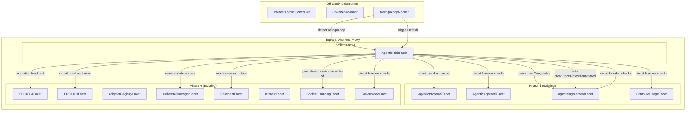
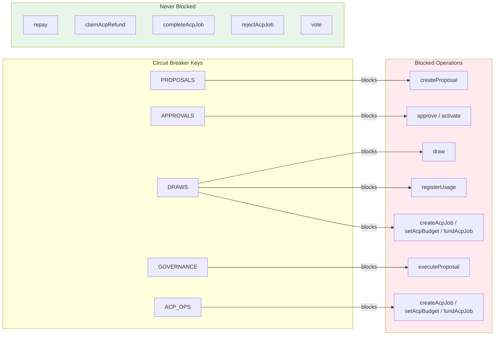
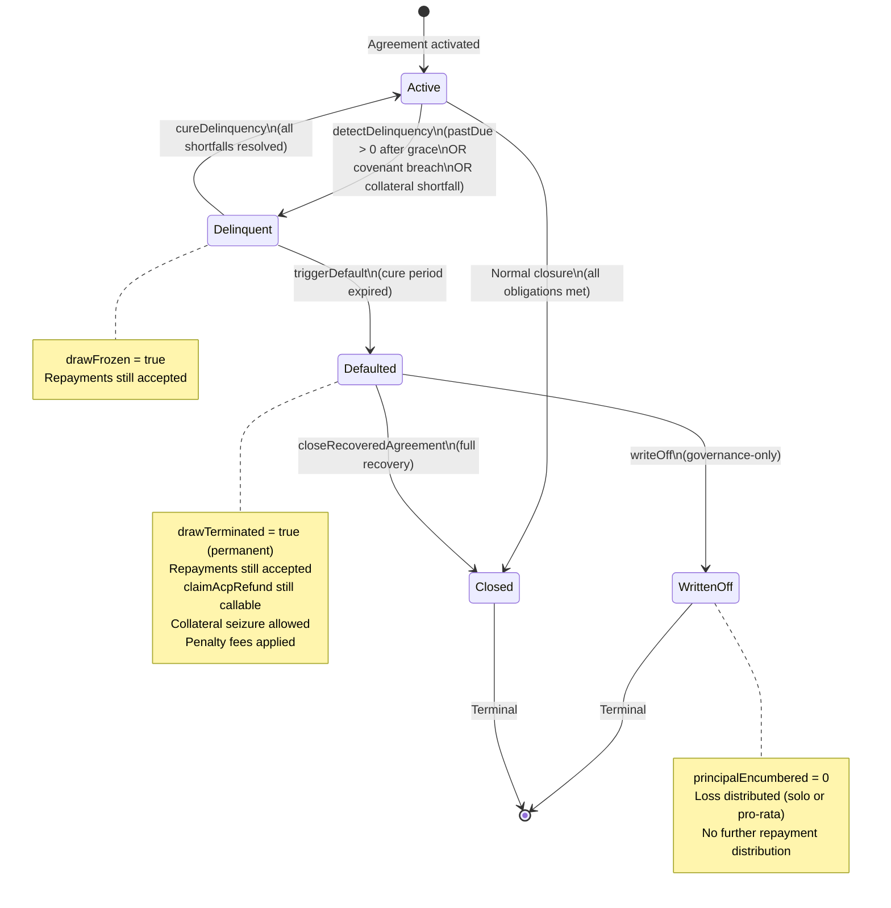
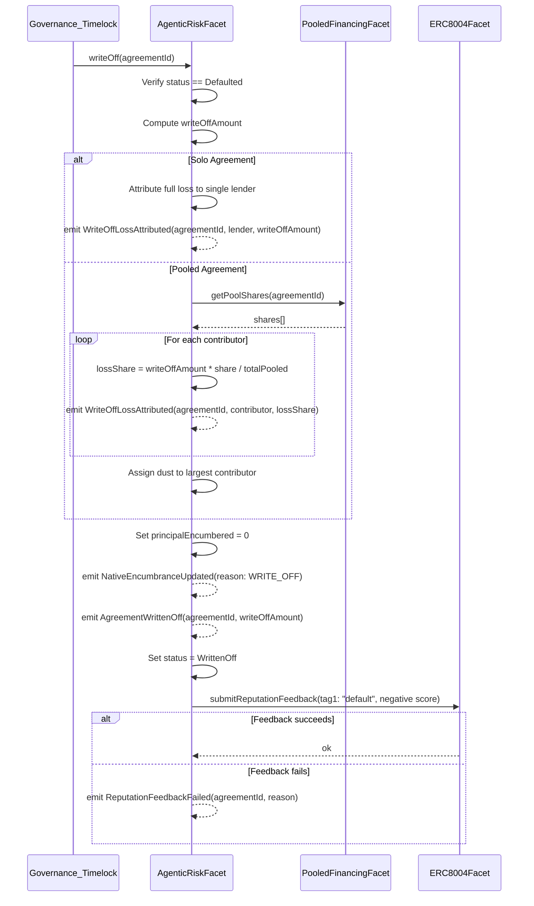
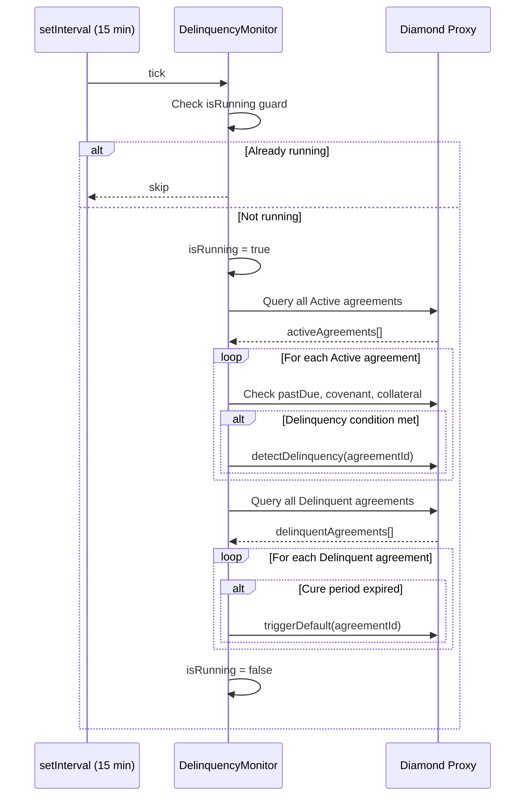

# Design Document — Synthesis Phase 5: Risk, Recovery & Testing

## Overview

Phase 5 completes the Equalis Agentic Financing protocol with production-grade risk management and comprehensive test coverage. Building on Phase 1 (core proposal/agreement/accounting), Phase 2 (event infrastructure), Phase 3 (compute provider adapters), and Phase 4 (ERC-8004/ERC-8183/collateral/covenant/interest/pooled/governance), Phase 5 delivers:

1. **AgenticRiskFacet** — A new Diamond facet implementing the delinquency/default/write-off state machine and circuit breaker management
2. **DelinquencyMonitor** — An off-chain scheduler that periodically detects delinquent agreements and triggers on-chain state transitions
3. **Full Invariant Test Suite** — Property-based tests covering cross-product accounting, encumbrance conservation, P4-1 through P4-7, ACP terminal-state sync, trust-mode gating, collateral toggle, and position transfer continuity
4. **Differential Portability Tests** — Identical accounting outcomes verified across ≥2 ERC-8183 adapters and ≥2 compute adapters
5. **Stress Testing & Gas Optimization** — High-volume agreement creation, concurrent metering, default cascades, and gas profiling
6. **Security Audit Preparation** — Access control review, reentrancy analysis, storage collision checks, upgrade safety verification

Phase 5 is additive. No semantic feature changes to Phase 1–4 facets or storage layouts are required; canonical reconciliation patches to Phase 1–4 documentation are allowed.
Phase 5 completion assumes Phase 4.5 reconciliation has been applied to align upstream phase docs with canonical v1.11 semantics.

### Cross-Chain Note (ERC-8004)

Phase 5 inherits Phase 4’s on-chain ERC-8004 assumptions: identity/reputation/validation adapters are read/called on the same chain as the Diamond. Cross-chain ERC-8004 (registry on Base, Diamond on Arbitrum) requires an oracle/bridge/cross-chain verification scheme and is out of scope here; use the Phase 2 offchain resolver for hackathon deployments.

### Design Decisions

1. **AgenticRiskFacet owns both state machine and circuit breakers** — Consolidating delinquency/default/write-off transitions and circuit breaker management into a single facet keeps risk logic cohesive and avoids cross-facet authorization complexity.
2. **Circuit breakers use `bytes32` keys** — `keccak256("PROPOSALS")`, `keccak256("APPROVALS")`, etc. mapped to `bool` in storage. This is extensible (new breaker keys can be added without storage migration) and gas-efficient (single SLOAD per check).
3. **Write-off is governance-only** — Only `Governance_Timelock` can call `writeOff()`. This prevents premature loss recognition and ensures write-offs go through governance deliberation.
4. **Refund liveness bypasses ALL circuit breakers** — `claimAcpRefund` never checks any breaker key, per canonical spec §10.3. This is a hard safety invariant.
5. **Penalty schedule adds to `feesAccrued`** — On default transition, `liquidationPenaltyBps` of outstanding principal is added to `feesAccrued`. This keeps the repayment waterfall (fees → interest → principal) unchanged.
6. **Write-off zeroes `principalEncumbered`** — The native encumbrance position is fully released on write-off, emitting `NativeEncumbranceUpdated` with reason `keccak256("WRITE_OFF")`.
7. **Pooled write-off dust goes to largest contributor** — Pro-rata loss distribution assigns rounding remainder to the contributor with the largest pool share, consistent with P4-7 repayment distribution.
8. **DelinquencyMonitor follows existing scheduler pattern** — Same `setInterval` + `isRunning` guard as `InterestAccrualScheduler` and `CovenantMonitor` from Phase 4.
9. **Delinquency state records `delinquentAt` timestamp** — Used for cure period timing. `triggerDefault` checks `block.timestamp - delinquentAt >= covenantCurePeriod`.
10. **`drawFrozen` vs `drawTerminated` semantics** — `drawFrozen` is reversible (set on delinquency, cleared on cure). `drawTerminated` is permanent (set on default, never cleared).

### Out of Scope

- Modifications to Phase 1 Diamond facets or storage layout
- Modifications to Phase 2 EventListener or TransactionSubmitter
- Modifications to Phase 3 compute provider adapters (Lambda, RunPod, Venice, Bankr)
- Modifications to Phase 4 ERC-8004, ERC-8183, collateral, covenant, interest, pooled, or governance facets
- Frontend or UI components
- Production mainnet deployment or HSM/KMS key management
- Module mirror bridge from native encumbrance state (optional, non-canonical)
- Token economics beyond the fee/interest model defined in canonical spec

---

## Architecture

### Facet Decomposition with AgenticRiskFacet




### Circuit Breaker Integration Map



### Agreement Risk State Machine



### Write-Off Accounting Flow



### DelinquencyMonitor Off-Chain Flow



---

## Components and Interfaces

### AgenticRiskFacet (Solidity)

```solidity
contract AgenticRiskFacet {
    // ─── Delinquency / Default / Write-Off State Machine ───

    /// @notice Detect delinquency on an Active agreement.
    /// @dev Checks payment shortfall (pastDue > 0 after grace), covenant breach, and collateral shortfall.
    ///      Sets drawFrozen = true, records delinquentAt timestamp.
    ///      Reverts with InvalidStatusTransition if not Active.
    ///      Reverts with NotDelinquent if no condition is met.
    function detectDelinquency(uint256 agreementId) external;

    /// @notice Cure a Delinquent agreement by verifying all shortfalls are resolved.
    /// @dev Sets drawFrozen = false (unless separate covenant breach freeze is active).
    ///      Reverts with InvalidStatusTransition if not Delinquent.
    ///      Reverts with DelinquencyNotCured if any shortfall remains.
    function cureDelinquency(uint256 agreementId) external;

    /// @notice Transition a Delinquent agreement to Defaulted after cure period expires.
    /// @dev Sets drawTerminated = true permanently. Applies liquidationPenaltyBps to feesAccrued.
    ///      Emits reputation feedback via ERC8004Facet (non-blocking).
    ///      Reverts with InvalidStatusTransition if not Delinquent.
    ///      Reverts with CurePeriodNotExpired if cure period has not elapsed.
    function triggerDefault(uint256 agreementId) external;

    /// @notice Close a Defaulted agreement after full recovery of all obligations.
    /// @dev Verifies principal + interest + fees are fully satisfied.
    ///      Reverts with InvalidStatusTransition if not Defaulted.
    ///      Reverts with ObligationsRemaining if outstanding debt exists.
    function closeRecoveredAgreement(uint256 agreementId) external;

    /// @notice Write off a Defaulted agreement. Governance_Timelock only.
    /// @dev Computes writeOffAmount, distributes loss (solo: full to lender, pooled: pro-rata).
    ///      Sets principalEncumbered = 0, emits NativeEncumbranceUpdated.
    ///      Emits reputation feedback via ERC8004Facet (non-blocking).
    ///      Reverts with NotAuthorized if caller is not Governance_Timelock.
    ///      Reverts with InvalidStatusTransition if not Defaulted.
    function writeOff(uint256 agreementId) external;

    // ─── Circuit Breakers ───

    /// @notice Toggle a circuit breaker. Governance_Timelock only.
    /// @param breakerKey keccak256 of breaker name (e.g., keccak256("PROPOSALS"))
    /// @param enabled true to activate (pause), false to deactivate (resume)
    function setCircuitBreaker(bytes32 breakerKey, bool enabled) external;

    /// @notice Check if a specific circuit breaker is active.
    function getCircuitBreaker(bytes32 breakerKey) external view returns (bool enabled);

    /// @notice Return the state of all 5 defined circuit breakers.
    function getAllCircuitBreakers() external view returns (
        bool proposals,
        bool approvals,
        bool draws,
        bool governance,
        bool acpOps
    );

    // ─── Internal Circuit Breaker Check (called by other facets via shared storage) ───

    /// @notice Revert if the specified breaker is active. Used by other facets.
    /// @dev Reads from Pause_Registry in AppStorage. Reverts with CircuitBreakerActive(breakerName).
    function requireNotPaused(bytes32 breakerKey) external view;

    // ─── View Functions ───

    /// @notice Get the delinquency state for an agreement.
    function getDelinquencyState(uint256 agreementId) external view returns (
        uint40 delinquentAt,
        uint256 pastDue,
        bool covenantBreached,
        bool collateralShortfall
    );

    /// @notice Get the write-off record for a written-off agreement.
    function getWriteOffRecord(uint256 agreementId) external view returns (
        uint256 writeOffAmount,
        uint40 writtenOffAt,
        bool isPooled
    );
}
```

### Circuit Breaker Check Library (Shared)

```solidity
library LibCircuitBreaker {
    bytes32 constant PROPOSALS_KEY = keccak256("PROPOSALS");
    bytes32 constant APPROVALS_KEY = keccak256("APPROVALS");
    bytes32 constant DRAWS_KEY = keccak256("DRAWS");
    bytes32 constant GOVERNANCE_KEY = keccak256("GOVERNANCE");
    bytes32 constant ACP_OPS_KEY = keccak256("ACP_OPS");

    /// @notice Revert if the specified breaker is active in the Pause_Registry.
    function requireNotPaused(bytes32 breakerKey) internal view {
        AgenticStorage storage s = LibAgenticStorage.agenticStorage();
        if (s.pauseRegistry[breakerKey]) {
            revert CircuitBreakerActive(breakerKey);
        }
    }
}
```

### DelinquencyMonitor (TypeScript)

```typescript
export class DelinquencyMonitor {
    private timer: NodeJS.Timeout | undefined;
    private isRunning = false;

    constructor(
        private readonly provider: ethers.Provider,
        private readonly signer: ethers.Signer,
        private readonly riskFacetAddress: string,
        private readonly agreementFacetAddress: string,
        private readonly intervalMs: number = 900_000, // 15 min default
        private readonly onError: (error: unknown) => void
    ) {}

    /** Start the periodic check cycle. Returns false if already started. */
    start(): boolean {
        if (this.timer) return false;
        this.timer = setInterval(() => this.runCycle(), this.intervalMs);
        return true;
    }

    /** Stop the periodic check cycle. Returns false if not running. */
    stop(): boolean {
        if (!this.timer) return false;
        clearInterval(this.timer);
        this.timer = undefined;
        return true;
    }

    /** Return current scheduler status. */
    status(): { enabled: boolean; running: boolean; intervalMs: number } {
        return {
            enabled: !!this.timer,
            running: this.isRunning,
            intervalMs: this.intervalMs,
        };
    }

    /**
     * Core cycle:
     * 1. Query all Active agreements, evaluate delinquency conditions
     * 2. Call detectDelinquency() for any that meet conditions
     * 3. Query all Delinquent agreements, check cure period expiry
     * 4. Call triggerDefault() for any past cure period
     */
    private async runCycle(): Promise<void> {
        if (this.isRunning) return;
        this.isRunning = true;
        try {
            const riskFacet = new ethers.Contract(
                this.riskFacetAddress,
                AgenticRiskFacetABI,
                this.signer
            );
            const agreementFacet = new ethers.Contract(
                this.agreementFacetAddress,
                AgenticAgreementFacetABI,
                this.signer
            );

            // Phase 1: Detect delinquencies on Active agreements
            const activeIds = await agreementFacet.getAgreementsByStatus(1); // Active
            for (const id of activeIds) {
                try {
                    await riskFacet.detectDelinquency(id);
                } catch (err: unknown) {
                    // NotDelinquent or InvalidStatusTransition are expected — skip
                    this.onError(err);
                }
            }

            // Phase 2: Trigger defaults on Delinquent agreements past cure period
            const delinquentIds = await agreementFacet.getAgreementsByStatus(2); // Delinquent
            for (const id of delinquentIds) {
                try {
                    await riskFacet.triggerDefault(id);
                } catch (err: unknown) {
                    // CurePeriodNotExpired is expected — skip
                    this.onError(err);
                }
            }
        } catch (err: unknown) {
            this.onError(err);
        } finally {
            this.isRunning = false;
        }
    }
}
```


---

## Data Models

### Delinquency State (On-Chain — extends AgenticStorage)

```solidity
// Per-agreement delinquency tracking
mapping(uint256 => uint40) agreementDelinquentAt;       // timestamp when delinquency was detected (0 if not delinquent)
mapping(uint256 => bool) agreementDrawFrozen;            // reversible draw freeze (already in Phase 4 CovenantFacet storage)
mapping(uint256 => bool) agreementDrawTerminated;        // permanent draw termination (already in Phase 4 CovenantFacet storage)
```

### Circuit Breaker Registry (On-Chain — extends AgenticStorage)

```solidity
// Pause registry: bytes32 breaker key => bool enabled
mapping(bytes32 => bool) pauseRegistry;

// Canonical breaker keys (computed at deploy, stored as constants in LibCircuitBreaker):
// keccak256("PROPOSALS")  => blocks createProposal
// keccak256("APPROVALS")  => blocks approve/activate
// keccak256("DRAWS")      => blocks draw, registerUsage, createAcpJob, setAcpBudget, fundAcpJob
// keccak256("GOVERNANCE") => blocks executeProposal
// keccak256("ACP_OPS")    => blocks createAcpJob, setAcpBudget, fundAcpJob
```

### Write-Off Records (On-Chain — extends AgenticStorage)

```solidity
struct WriteOffRecord {
    uint256 writeOffAmount;          // net unrecovered loss
    uint40 writtenOffAt;             // timestamp of write-off execution
    bool isPooled;                   // true if pooled agreement (pro-rata distribution)
}

// Per-agreement write-off record
mapping(uint256 => WriteOffRecord) writeOffRecords;

// Per-agreement per-lender loss attribution (for pooled agreements)
mapping(uint256 => mapping(address => uint256)) writeOffLossShares;  // agreementId => lender => loss amount
```

### Penalty Schedule (On-Chain — uses existing agreement fields)

The penalty schedule leverages existing `FinancingAgreement` fields:
- `liquidationPenaltyBps` — basis points of outstanding principal added to `feesAccrued` on default transition
- `feesAccrued` — accumulates penalty fees alongside origination/service/late fees

No new storage mappings are needed for the penalty schedule.

### Write-Off Amount Computation

```
writeOffAmount = principalDrawn
               - principalRepaid
               + interestAccrued
               + feesAccrued
               - cumulativePayments
               - collateralSeized
```

Where `cumulativePayments` is the total of all repayments applied to the agreement (tracked in existing `AgenticStorage.cumulativePayments` mapping).

### Canonical Policy Defaults (Phase 5 Additions)

| Parameter | Default | Source |
|---|---|---|
| `gracePeriod` | 3–30 days | Canonical Spec §14 |
| `covenantCurePeriod` | 7 days | Canonical Spec §14 |
| `liquidationPenaltyBps` | Agreement-specific | Set at proposal creation |
| `collateralEnabled` | false | Canonical Spec §14 |
| `minCollateralRatioBps` | 11000 (110%) | Canonical Spec §14 |
| `maintenanceCollateralRatioBps` | 10500 (105%) | Canonical Spec §14 |
| Circuit breaker authority | Governance_Timelock | Canonical Spec §14 |
| DelinquencyMonitor interval | 15 minutes | Operational default |
| `claimAcpRefund` pausability | Non-pausable (bypasses all breakers) | Canonical Spec §10.3 |

### Events (Phase 5 Additions)

```solidity
// Delinquency / Default / Write-Off
event AgreementDelinquent(uint256 indexed agreementId, uint256 pastDue);
event AgreementDelinquencyCured(uint256 indexed agreementId);
event AgreementDefaulted(uint256 indexed agreementId, uint256 pastDue);
event AgreementClosed(uint256 indexed agreementId);
event AgreementWrittenOff(uint256 indexed agreementId, uint256 writeOffAmount);
event WriteOffLossAttributed(uint256 indexed agreementId, address indexed lender, uint256 lossAmount);
event ReputationFeedbackFailed(uint256 indexed agreementId, bytes reason);

// Circuit Breakers
event CircuitBreakerToggled(bytes32 indexed breakerKey, bool enabled, address indexed caller);

// NativeEncumbranceUpdated is reused from Phase 1 with reason = keccak256("WRITE_OFF")
```


---

## Correctness Properties

### Property P5-1: Delinquency state machine transition correctness

*For any* agreement, the only valid status transitions are: Active → Delinquent, Delinquent → Active (cure), Delinquent → Defaulted, Defaulted → Closed (full recovery), Defaulted → WrittenOff, and Active → Closed (normal closure). *For any* attempt to invoke a transition not in this set, the AgenticRiskFacet SHALL revert with `InvalidStatusTransition`. WrittenOff and Closed are terminal — no outbound transitions exist.

**Validates: Requirements 1, 2, 3, 4, 5, 31**

### Property P5-2: Delinquency detection completeness

*For any* Active agreement, `detectDelinquency` SHALL transition to Delinquent if and only if at least one of the following holds: (a) `pastDue > 0` and `block.timestamp > firstDueAt + gracePeriod`, (b) a coverage covenant breach exists per CovenantFacet `checkCovenant`, or (c) `collateralEnabled == true` and the collateral ratio is below `maintenanceCollateralRatioBps`. If none of these conditions hold, the call SHALL revert with `NotDelinquent`. The detection is a pure function of on-chain state — no off-chain input affects the outcome.

**Validates: Requirements 1, 2, 3**

### Property P5-3: Draw freeze reversibility vs. termination permanence

*For any* agreement transitioning to Delinquent, `drawFrozen` is set to `true` and MAY be set back to `false` upon successful cure. *For any* agreement transitioning to Defaulted, `drawTerminated` is set to `true` and SHALL never be set back to `false` for the lifetime of the agreement. Once `drawTerminated == true`, no draw-path function (`draw`, `registerUsage`, `createAcpJob`, `setAcpBudget`, `fundAcpJob`) SHALL succeed, regardless of any subsequent state change.

**Validates: Requirements 1, 2, 3, 21, 31**

### Property P5-4: Cure period timing boundary

*For any* Delinquent agreement, `triggerDefault` SHALL revert with `CurePeriodNotExpired` when `block.timestamp - delinquentAt < covenantCurePeriod`. `triggerDefault` SHALL succeed when `block.timestamp - delinquentAt >= covenantCurePeriod`. `cureDelinquency` SHALL succeed at any point during the cure window provided all shortfalls are resolved. The timing boundary is deterministic for a given `(delinquentAt, covenantCurePeriod)` pair.

**Validates: Requirements 2, 3, 22**

### Property P5-5: Write-off amount computation correctness

*For any* Defaulted agreement, the `writeOffAmount` computed by `writeOff` SHALL equal `principalDrawn - principalRepaid + interestAccrued + feesAccrued - cumulativePayments - collateralSeized`. This value represents the net unrecovered loss. If the computed value is zero or negative (full recovery achieved), `writeOff` is semantically a no-loss close — but the governance path still applies.

**Validates: Requirements 5**

### Property P5-6: Solo write-off full attribution

*For any* solo agreement (SoloAgentic or SoloCompute) that is written off, the full `writeOffAmount` SHALL be attributed to the single lender identified by the agreement's `lenderPositionKey`. Exactly one `WriteOffLossAttributed` event SHALL be emitted with `lossAmount == writeOffAmount`. No other address receives loss attribution. After write-off, `principalEncumbered == 0` and no further repayment distribution occurs.

**Validates: Requirements 6**

### Property P5-7: Pooled write-off pro-rata conservation

*For any* pooled agreement (PooledAgentic or PooledCompute) that is written off, the sum of all individual loss shares SHALL equal exactly `writeOffAmount` — no funds are lost to rounding. Each contributor's loss share equals `floor(writeOffAmount * lenderPoolShare / totalPooled)`, and the remainder (at most `n - 1` wei where `n` is the contributor count) is assigned to the largest pool contributor. One `WriteOffLossAttributed` event is emitted per contributor.

**Validates: Requirements 7, 24**

### Property P5-8: Circuit breaker isolation and independence

*For any* circuit breaker key `K` in {PROPOSALS, APPROVALS, DRAWS, GOVERNANCE, ACP_OPS}, activating `K` SHALL block exactly the operations specified for `K` and no others. Activating `K` SHALL NOT affect operations controlled by any other breaker key. *For all* 32 combinations of breaker states (2^5), the set of blocked operations is the union of individually blocked operations — no emergent cross-breaker effects exist.

**Validates: Requirements 8, 9, 10, 11, 12, 32**

### Property P5-9: Refund liveness non-pausability

*For any* ACP job that has passed its `expiredAt` timestamp without reaching a terminal state, `claimAcpRefund` SHALL remain callable regardless of any combination of circuit breaker states, draw freeze state, or draw termination state. No circuit breaker key SHALL gate `claimAcpRefund`. The refund accounting (reduce `principalDrawn`, emit `ACPJobResolved`) SHALL execute identically whether zero or all five breakers are active.

**Validates: Requirements 13**

### Property P5-10: Repayment liveness under all pause states

*For any* agreement in any non-terminal status (Active, Delinquent, Defaulted), repayment calls SHALL succeed regardless of any circuit breaker state, draw freeze state, or draw termination state. Repayment is never pausable. The repayment waterfall (fees → interest → principal) SHALL execute identically under all breaker combinations.

**Validates: Requirements 3, 10, 32**

### Property P5-11: Encumbrance conservation through write-off

*For any* agreement, the invariant `principalEncumbered = principalDrawn - principalRepaid` holds after every draw, repay, and ACP refund operation. Upon write-off, `principalEncumbered` is set to exactly zero and a `NativeEncumbranceUpdated` event with reason `keccak256("WRITE_OFF")` is emitted. After write-off, no operation can increase `principalEncumbered` above zero for that agreement.

**Validates: Requirements 5, 17**

### Property P5-12: Cross-product accounting equivalence

*For any* set of equivalent inputs (same principal, same rate, same fees, same repayment amounts), the repayment waterfall (fees → interest → principal) SHALL produce identical allocation amounts across SoloAgentic, PooledAgentic, SoloCompute, and PooledCompute agreements. The 70/30 lender/protocol fee split SHALL be applied identically across all four product types. Pooled agreements distribute the lender portion pro-rata but the total amounts are identical.

**Validates: Requirements 16**

### Property P5-13: P4 invariant preservation (P4-1 through P4-7)

*For any* operation sequence that includes Phase 5 state transitions (delinquency, default, write-off, circuit breaker toggles), all Phase 4 invariants SHALL continue to hold: collateral conservation (P4-1), interest monotonicity (P4-2), covenant breach detection correctness (P4-3), draw freeze enforcement (P4-4), cure period timing (P4-5), pool share conservation (P4-6), and pro-rata distribution correctness (P4-7). Phase 5 is additive and SHALL NOT violate any previously established property.

**Validates: Requirements 18, 19, 20, 21, 22, 23, 24**

### Property P5-14: ACP terminal state accounting synchronization

*For any* ACP job reaching terminal state Completed, `principalDrawn` on the linked agreement remains unchanged. *For any* ACP job reaching terminal state Rejected or Expired, `principalDrawn` decreases by exactly the escrowed budget. No ACP job can transition to a terminal state more than once (terminal finality). Accounting adjustments are applied exactly once per terminal transition. These properties hold identically regardless of which adapter processes the transition.

**Validates: Requirements 25**

### Property P5-15: Trust mode gating determinism

*For any* agreement, trust mode gating is a pure function of `(trustMode, adapterQueryResults)`. DiscoveryOnly allows activation unconditionally. ReputationOnly requires `reputationValue >= minReputationValue`. ValidationRequired requires `validationResponse >= minValidationResponse`. Hybrid requires both. Two calls with the same inputs SHALL produce identical gating decisions. No Phase 5 state (delinquency, breakers) affects trust mode evaluation.

**Validates: Requirements 26**

### Property P5-16: Collateral toggle independence

*For any* agreement with `collateralEnabled = false`, the agreement SHALL activate and operate without any collateral-related checks. `postCollateral` SHALL revert. Collateral shortfall delinquency SHALL NOT be triggered. *For any* agreement with `collateralEnabled = true`, `minCollateralRatioBps` SHALL be enforced at activation and `maintenanceCollateralRatioBps` SHALL be enforced for delinquency detection. The toggle is a binary gate — no partial enforcement exists.

**Validates: Requirements 27**

### Property P5-17: Position transfer continuity

*For any* agreement whose underlying position NFT is transferred, the agreement's `principalEncumbered`, `principalDrawn`, `principalRepaid`, `interestAccrued`, and `feesAccrued` SHALL remain unchanged. The new position holder SHALL be able to execute authorized operations (repay, close). Encumbrance conservation holds across transfers. No accounting field is reset or modified by the transfer itself.

**Validates: Requirements 28**

### Property P5-18: Differential ERC-8183 adapter portability

*For any* ACP job lifecycle sequence (create → fund → submit → complete, create → fund → submit → reject, create → fund → expire → claimRefund), replaying the sequence through Reference8183Adapter and MockGeneric8183Adapter SHALL produce identical values for `principalDrawn`, `principalRepaid`, `principalEncumbered`, `interestAccrued`, and `feesAccrued` on the linked agreement. Terminal state accounting (refund amounts) SHALL be identical. The adapter choice SHALL NOT affect core agreement accounting.

**Validates: Requirements 29**

### Property P5-19: Differential compute adapter portability

*For any* compute usage sequence (register usage, accrue interest, repay), replaying the sequence through at least two compute adapters (e.g., Venice + Lambda, Bankr + Lambda, Venice + RunPod, or Bankr + RunPod) SHALL produce identical values for `principalDrawn`, `unitsEncumbered`, `interestAccrued`, and `feesAccrued` on the linked agreement. The monetary liability computation (`usedUnits * unitPrice`) SHALL be identical across adapters for the same unit type and quantity.

**Validates: Requirements 30**

### Property P5-20: Penalty schedule correctness

*For any* agreement transitioning from Delinquent to Defaulted, the penalty amount `liquidationPenaltyBps * outstandingPrincipal / 10000` SHALL be added to `feesAccrued`. The penalty is applied exactly once at the moment of default transition. The repayment waterfall ordering (fees → interest → principal) is unchanged — penalty fees are repaid in the same priority as other fees.

**Validates: Requirements 3**

### Property P5-21: Governance-only write-off authorization

*For any* call to `writeOff(agreementId)`, the caller MUST be the `Governance_Timelock` address. All other callers SHALL receive `NotAuthorized`. This restriction is absolute — no admin role, no borrower, no lender can bypass it. Combined with P5-1, write-off is only reachable from the Defaulted state by the governance timelock.

**Validates: Requirements 5, 38**

### Property P5-22: Reputation feedback non-blocking semantics

*For any* default or write-off transition that triggers `submitReputationFeedback` on ERC8004Facet, a failure in the reputation adapter call SHALL NOT revert the state transition. The AgenticRiskFacet SHALL emit `ReputationFeedbackFailed(agreementId, reason)` and continue. The state machine transition (Delinquent → Defaulted, or Defaulted → WrittenOff) SHALL complete regardless of reputation adapter availability.

**Validates: Requirements 42**

### Property P5-23: Module independence

*For any* financing operation sequence (draw, repay, delinquency, default, write-off, close), the outcome SHALL be identical regardless of whether any module registry is paused or inactive. Native encumbrance updates SHALL occur correctly when module bridges are unavailable. Agreement accounting (`principalDrawn`, `principalRepaid`, `interestAccrued`, `feesAccrued`) SHALL not depend on module bridge state.

**Validates: Requirements 43**

### Property P5-24: Default recovery completeness

*For any* Defaulted agreement that receives sufficient repayments and collateral recovery to fully satisfy all outstanding obligations (principal + interest + fees), `closeRecoveredAgreement` SHALL transition the agreement to Closed. If any obligation remains, the call SHALL revert with `ObligationsRemaining`. Recovery is the only non-write-off exit from Defaulted status.

**Validates: Requirements 4**

### Property P5-25: Circuit breaker governance authorization

*For any* call to `setCircuitBreaker(breakerKey, enabled)`, the caller MUST be the `Governance_Timelock` address. All other callers SHALL receive `NotAuthorized`. Every state change SHALL emit `CircuitBreakerToggled(breakerKey, enabled, caller)`. The breaker state is a simple boolean per key — no complex state machine governs breaker transitions.

**Validates: Requirements 8, 9, 10, 11, 12, 38**

### Property P5-26: Delinquency monitor liveness

*For any* running DelinquencyMonitor instance, the monitor SHALL execute a check cycle at least once per configured interval (default 15 minutes). The `isRunning` guard SHALL prevent concurrent cycles. Failed on-chain transactions SHALL be logged and retried on the next cycle — a single failure SHALL NOT halt the monitor. The monitor SHALL detect delinquencies on Active agreements and trigger defaults on Delinquent agreements past their cure period.

**Validates: Requirements 15**

---

## Error Handling

### AgenticRiskFacet Errors

| Error Condition | Revert Reason | Access |
|---|---|---|
| Agreement not in expected status for transition | `InvalidStatusTransition` | Any caller |
| No delinquency condition met on Active agreement | `NotDelinquent` | Any caller |
| Shortfalls remain when attempting cure | `DelinquencyNotCured` | Any caller |
| Cure period has not elapsed for default trigger | `CurePeriodNotExpired` | Any caller |
| Outstanding obligations remain for recovery close | `ObligationsRemaining` | Any caller |
| Caller is not Governance_Timelock (write-off) | `NotAuthorized` | Non-governance caller |
| Caller is not Governance_Timelock (circuit breaker) | `NotAuthorized` | Non-governance caller |
| Operation blocked by active circuit breaker | `CircuitBreakerActive(breakerKey)` | Any caller |

### Cross-Facet Circuit Breaker Errors

| Blocked Operation | Breaker Key | Revert Reason |
|---|---|---|
| `createProposal` | `PROPOSALS` | `CircuitBreakerActive("PROPOSALS")` |
| `approve` / `activate` | `APPROVALS` | `CircuitBreakerActive("APPROVALS")` |
| `draw` / `registerUsage` | `DRAWS` | `CircuitBreakerActive("DRAWS")` |
| `createAcpJob` / `setAcpBudget` / `fundAcpJob` | `DRAWS` or `ACP_OPS` | `CircuitBreakerActive(key)` |
| `executeProposal` | `GOVERNANCE` | `CircuitBreakerActive("GOVERNANCE")` |

### Non-Blocking Failures

| Operation | Failure Mode | Behavior |
|---|---|---|
| Reputation feedback on default | ERC-8004 adapter call fails | Emit `ReputationFeedbackFailed`, continue transition |
| Reputation feedback on write-off | ERC-8004 adapter call fails | Emit `ReputationFeedbackFailed`, continue transition |
| DelinquencyMonitor on-chain tx | `NotDelinquent` / `CurePeriodNotExpired` | Log error, skip to next agreement |
| DelinquencyMonitor on-chain tx | Network/gas failure | Log error, retry next cycle |

---

## Testing Strategy

### Unit Tests

- AgenticRiskFacet: detectDelinquency (payment shortfall, covenant breach, collateral shortfall triggers), cureDelinquency (all shortfalls resolved, partial shortfall rejection), triggerDefault (cure period timing, penalty application, drawTerminated permanence), closeRecoveredAgreement (full recovery verification, obligations remaining rejection), writeOff (governance-only auth, writeOffAmount computation, encumbrance zeroing, solo vs pooled distribution)
- Circuit breakers: setCircuitBreaker (governance auth, toggle on/off, event emission), getCircuitBreaker/getAllCircuitBreakers (view correctness), requireNotPaused (revert on active breaker, pass on inactive)
- DelinquencyMonitor: start/stop lifecycle, isRunning guard, runCycle detection and default triggering, error handling and retry

### Invariant Tests (Property-Based / Fuzz)

- State machine transitions (P5-1): fuzz all status × function combinations, verify only canonical transitions succeed
- Delinquency detection (P5-2): fuzz pastDue, covenant state, collateral ratios — verify detection iff condition met
- Draw freeze vs termination (P5-3): fuzz delinquency/cure/default sequences — verify freeze reversibility and termination permanence
- Cure period timing (P5-4): fuzz timestamps and cure periods — verify boundary correctness
- Write-off computation (P5-5): fuzz principal/interest/fees/payments/collateral — verify formula correctness
- Solo write-off (P5-6): fuzz solo agreements — verify full attribution to single lender
- Pooled write-off (P5-7): fuzz pool configurations and write-off amounts — verify pro-rata conservation
- Circuit breaker isolation (P5-8): enumerate all 32 breaker combinations — verify operation blocking matrix
- Refund liveness (P5-9): fuzz breaker states — verify claimAcpRefund always succeeds
- Repayment liveness (P5-10): fuzz breaker states — verify repay always succeeds
- Encumbrance conservation (P5-11): fuzz draw/repay/refund/write-off sequences — verify invariant holds
- Cross-product equivalence (P5-12): fuzz inputs across all 4 product types — verify identical waterfall
- P4 invariant preservation (P5-13): fuzz Phase 5 operations — verify P4-1 through P4-7 still hold
- ACP terminal sync (P5-14): fuzz job lifecycles — verify accounting synchronization
- Module independence (P5-23): fuzz module registry states — verify no effect on financing

### Differential Tests

- ERC-8183 adapter portability (P5-18): replay identical job lifecycles through Reference8183Adapter and MockGeneric8183Adapter — assert identical accounting
- Compute adapter portability (P5-19): replay identical usage sequences through Venice/Bankr + Lambda/RunPod pairings — assert identical accounting
- Solo vs Pooled accounting: same inputs through solo and pooled paths — assert identical totals (distribution differs)

### Stress Tests

- High-volume agreement creation (Req 34): 100+ agreements across all product types, concurrent draws/repays, gas profiling
- Concurrent metering (Req 35): 20+ compute agreements with concurrent registerUsage, verify no cross-agreement interference
- Default cascade (Req 36): 10+ simultaneous defaults, overlapping pooled write-offs, circuit breaker interaction during cascade
- Gas profiling (Req 37): measure all critical operations, flag >500k gas, profile pooled distribution scaling (2/5/10/20 contributors)

### Security Tests

- Access control (Req 38): verify every privileged function reverts for unauthorized callers (Admin_Role, Governance_Timelock, borrower, lender gates)
- Reentrancy (Req 39): deploy malicious mocks attempting reentrancy on collateral, ACP fund/refund, repayment distribution — verify guards hold
- Storage collision (Req 40): verify `AGENTIC_STORAGE_POSITION` uniqueness, verify AgenticRiskFacet addition doesn't corrupt existing storage, verify delegatecall isolation
- Upgrade safety (Req 41): verify diamondCut addition of AgenticRiskFacet preserves all existing facet behavior, verify selector replacement preserves state, verify selector removal reverts cleanly

### Test Organization

```
test/
├── facets/
│   └── agentic-risk.test.ts
├── circuit-breakers/
│   ├── breaker-isolation.test.ts
│   ├── refund-liveness.test.ts
│   └── repayment-liveness.test.ts
├── state-machine/
│   ├── delinquency-detection.test.ts
│   ├── cure-and-default.test.ts
│   ├── write-off-solo.test.ts
│   └── write-off-pooled.test.ts
├── invariant/
│   ├── state-machine-transitions.test.ts
│   ├── encumbrance-conservation.test.ts
│   ├── cross-product-accounting.test.ts
│   ├── p4-invariant-preservation.test.ts
│   ├── acp-terminal-sync.test.ts
│   └── module-independence.test.ts
├── differential/
│   ├── erc8183-adapter-portability.test.ts
│   ├── compute-adapter-portability.test.ts
│   └── solo-vs-pooled.test.ts
├── stress/
│   ├── high-volume-agreements.test.ts
│   ├── concurrent-metering.test.ts
│   ├── default-cascade.test.ts
│   └── gas-profiling.test.ts
├── security/
│   ├── access-control.test.ts
│   ├── reentrancy.test.ts
│   ├── storage-collision.test.ts
│   └── upgrade-safety.test.ts
└── schedulers/
    └── delinquency-monitor.test.ts
```
